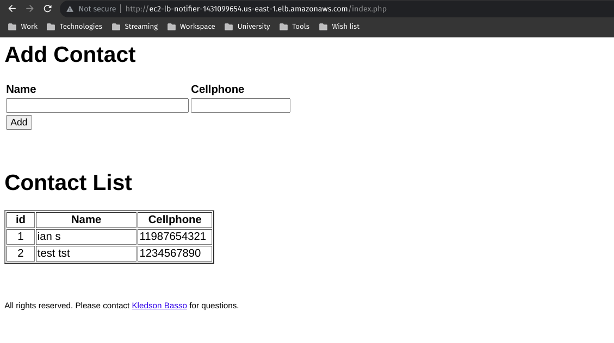

# Checkpoint 3
### Documentação de resolução do desafio passado durante o checkpoint 3 da matéria de GitOps

# #1
Criação dos recursos da arquitetura proposta na conta AWS, conforme código Terraform fornecido. 
Incluir resultado dos comandos terraform plan, terraform apply e terraform show no conteúdo do pull request.

$ terraform plan -out tfplan
```
Terraform used the selected providers to generate the following execution
plan. Resource actions are indicated with the following symbols:
+ create
<= read (data resources)

Terraform will perform the following actions:

# module.compute.data.template_file.user_data will be read during apply
# (config refers to values not yet known)
<= data "template_file" "user_data" {
    + id       = (known after apply)
    + rendered = (known after apply)
    + template = <<-EOT
            #!/bin/bash


            # 1- Update/Install required OS packages
            yum update -y
            amazon-linux-extras install -y php7.2 epel
            yum install -y httpd mysql php-mtdowling-jmespath-php php-xml telnet tree git


            # 2- (Optional) Enable PHP to send AWS SNS events
            # NOTE: If uncommented, more configs are required
            # - Step 4: Deploy PHP app
            # - Module Compute: compute.tf and vars.tf manifests

            # 2.1- Config AWS SDK for PHP
            # mkdir -p /opt/aws/sdk/php/
            # cd /opt/aws/sdk/php/
            # wget https://docs.aws.amazon.com/aws-sdk-php/v3/download/aws.zip
            # unzip aws.zip

            # 2.2- Config AWS Account
            # mkdir -p /var/www/html/.aws/
            # cat <<EOT >> /var/www/html/.aws/credentials
            # [default]
            # aws_access_key_id=12345
            # aws_secret_access_key=12345
            # aws_session_token=12345
            # EOT


            # 3- Config PHP app Connection to Database
            cat <<EOT >> /var/www/config.php
            <?php
            define('DB_SERVER', '${rds_endpoint}');
            define('DB_USERNAME', '${rds_dbuser}');
            define('DB_PASSWORD', '${rds_dbpassword}');
            define('DB_DATABASE', '${rds_dbname}');
            ?>
            EOT


            # 4- Deploy PHP app
            cd /tmp
            git clone https://github.com/kledsonhugo/notifier
            cp /tmp/notifier/app/*.php /var/www/html/
            # mv /var/www/html/sendsms.php /var/www/html/index.php
            rm -rf /tmp/notifier


            # 5- Config Apache WebServer
            usermod -a -G apache ec2-user
            chown -R ec2-user:apache /var/www
            chmod 2775 /var/www
            find /var/www -type d -exec chmod 2775 {} \;
            find /var/www -type f -exec chmod 0664 {} \;


            # 6- Start Apache WebServer
            systemctl enable httpd
            service httpd restart
        EOT
    + vars     = {
        + "rds_dbname"     = "rdsdbnotifier"
        + "rds_dbpassword" = "rdsdbadminpwd"
        + "rds_dbuser"     = "rdsdbadmin"
        + "rds_endpoint"   = (known after apply)
        }
    }

# module.compute.aws_autoscaling_group.ec2_asg will be created
+ resource "aws_autoscaling_group" "ec2_asg" {
    + arn                       = (known after apply)
    + availability_zones        = (known after apply)
    + default_cooldown          = (known after apply)
    + desired_capacity          = 4
    + force_delete              = false
    + force_delete_warm_pool    = false
    + health_check_grace_period = 300
    + health_check_type         = (known after apply)
    + id                        = (known after apply)
    + max_size                  = 8
    + metrics_granularity       = "1Minute"
    + min_size                  = 2
    + name                      = "ec2-asg-notifier"
    + name_prefix               = (known after apply)
    + protect_from_scale_in     = false
    + service_linked_role_arn   = (known after apply)
    + target_group_arns         = (known after apply)
    + vpc_zone_identifier       = (known after apply)
    + wait_for_capacity_timeout = "10m"

    + launch_template {
        + id      = (known after apply)
        + name    = (known after apply)
        + version = "$Latest"
        }
    }

# module.compute.aws_launch_template.ec2_lt will be created
+ resource "aws_launch_template" "ec2_lt" {
    + arn                    = (known after apply)
    + default_version        = (known after apply)
    + id                     = (known after apply)
    + image_id               = "ami-069aabeee6f53e7bf"
    + instance_type          = "t2.micro"
    + key_name               = "vockey"
    + latest_version         = (known after apply)
    + name                   = "ec2-lt-notifier"
    + name_prefix            = (known after apply)
    + tags_all               = (known after apply)
    + user_data              = (known after apply)
    + vpc_security_group_ids = (known after apply)

    + metadata_options {
        + http_endpoint               = (known after apply)
        + http_protocol_ipv6          = (known after apply)
        + http_put_response_hop_limit = (known after apply)
        + http_tokens                 = (known after apply)
        + instance_metadata_tags      = (known after apply)
        }
    }

# module.compute.aws_lb.ec2_lb will be created
+ resource "aws_lb" "ec2_lb" {
    + arn                                         = (known after apply)
    + arn_suffix                                  = (known after apply)
    + desync_mitigation_mode                      = "defensive"
    + dns_name                                    = (known after apply)
    + drop_invalid_header_fields                  = false
    + enable_deletion_protection                  = false
    + enable_http2                                = true
    + enable_tls_version_and_cipher_suite_headers = false
    + enable_waf_fail_open                        = false
    + enable_xff_client_port                      = false
    + id                                          = (known after apply)
    + idle_timeout                                = 60
    + internal                                    = (known after apply)
    + ip_address_type                             = (known after apply)
    + load_balancer_type                          = "application"
    + name                                        = "ec2-lb-notifier"
    + preserve_host_header                        = false
    + security_groups                             = (known after apply)
    + subnets                                     = (known after apply)
    + tags_all                                    = (known after apply)
    + vpc_id                                      = (known after apply)
    + xff_header_processing_mode                  = "append"
    + zone_id                                     = (known after apply)

    + subnet_mapping {
        + allocation_id        = (known after apply)
        + ipv6_address         = (known after apply)
        + outpost_id           = (known after apply)
        + private_ipv4_address = (known after apply)
        + subnet_id            = (known after apply)
        }
    }

# module.compute.aws_lb_listener.ec2_lb_listener will be created
+ resource "aws_lb_listener" "ec2_lb_listener" {
    + arn               = (known after apply)
    + id                = (known after apply)
    + load_balancer_arn = (known after apply)
    + port              = 80
    + protocol          = "HTTP"
    + ssl_policy        = (known after apply)
    + tags_all          = (known after apply)

    + default_action {
        + order            = (known after apply)
        + target_group_arn = (known after apply)
        + type             = "forward"
        }
    }

# module.compute.aws_lb_target_group.ec2_lb_tg will be created
+ resource "aws_lb_target_group" "ec2_lb_tg" {
    + arn                                = (known after apply)
    + arn_suffix                         = (known after apply)
    + connection_termination             = false
    + deregistration_delay               = "300"
    + id                                 = (known after apply)
    + ip_address_type                    = (known after apply)
    + lambda_multi_value_headers_enabled = false
    + load_balancing_algorithm_type      = (known after apply)
    + load_balancing_cross_zone_enabled  = (known after apply)
    + name                               = "ec2-lb-tg-notifier"
    + port                               = 80
    + preserve_client_ip                 = (known after apply)
    + protocol                           = "HTTP"
    + protocol_version                   = (known after apply)
    + proxy_protocol_v2                  = false
    + slow_start                         = 0
    + tags_all                           = (known after apply)
    + target_type                        = "instance"
    + vpc_id                             = (known after apply)

    + health_check {
        + enabled             = (known after apply)
        + healthy_threshold   = (known after apply)
        + interval            = (known after apply)
        + matcher             = (known after apply)
        + path                = (known after apply)
        + port                = (known after apply)
        + protocol            = (known after apply)
        + timeout             = (known after apply)
        + unhealthy_threshold = (known after apply)
        }

    + stickiness {
        + cookie_duration = (known after apply)
        + cookie_name     = (known after apply)
        + enabled         = (known after apply)
        + type            = (known after apply)
        }

    + target_failover {
        + on_deregistration = (known after apply)
        + on_unhealthy      = (known after apply)
        }
    }

# module.database.aws_db_instance.rds_dbinstance will be created
+ resource "aws_db_instance" "rds_dbinstance" {
    + address                               = (known after apply)
    + allocated_storage                     = 20
    + apply_immediately                     = false
    + arn                                   = (known after apply)
    + auto_minor_version_upgrade            = true
    + availability_zone                     = (known after apply)
    + backup_retention_period               = (known after apply)
    + backup_window                         = (known after apply)
    + ca_cert_identifier                    = (known after apply)
    + character_set_name                    = (known after apply)
    + copy_tags_to_snapshot                 = false
    + db_name                               = "rdsdbnotifier"
    + db_subnet_group_name                  = "rds-sn-group-notifier"
    + delete_automated_backups              = true
    + endpoint                              = (known after apply)
    + engine                                = "mysql"
    + engine_version                        = "8.0.23"
    + engine_version_actual                 = (known after apply)
    + hosted_zone_id                        = (known after apply)
    + id                                    = (known after apply)
    + identifier                            = "rds-notifier"
    + identifier_prefix                     = (known after apply)
    + instance_class                        = "db.t2.micro"
    + iops                                  = (known after apply)
    + kms_key_id                            = (known after apply)
    + latest_restorable_time                = (known after apply)
    + license_model                         = (known after apply)
    + listener_endpoint                     = (known after apply)
    + maintenance_window                    = (known after apply)
    + master_user_secret                    = (known after apply)
    + master_user_secret_kms_key_id         = (known after apply)
    + max_allocated_storage                 = 0
    + monitoring_interval                   = 0
    + monitoring_role_arn                   = (known after apply)
    + multi_az                              = false
    + name                                  = (known after apply)
    + nchar_character_set_name              = (known after apply)
    + network_type                          = (known after apply)
    + option_group_name                     = (known after apply)
    + parameter_group_name                  = "rds-param-group-notifier"
    + password                              = (sensitive value)
    + performance_insights_enabled          = false
    + performance_insights_kms_key_id       = (known after apply)
    + performance_insights_retention_period = (known after apply)
    + port                                  = (known after apply)
    + publicly_accessible                   = false
    + replica_mode                          = (known after apply)
    + replicas                              = (known after apply)
    + resource_id                           = (known after apply)
    + skip_final_snapshot                   = true
    + snapshot_identifier                   = (known after apply)
    + status                                = (known after apply)
    + storage_throughput                    = (known after apply)
    + storage_type                          = "gp2"
    + tags_all                              = (known after apply)
    + timezone                              = (known after apply)
    + username                              = "rdsdbadmin"
    + vpc_security_group_ids                = (known after apply)
    }

# module.database.aws_db_parameter_group.rds_param_group will be created
+ resource "aws_db_parameter_group" "rds_param_group" {
    + arn         = (known after apply)
    + description = "Managed by Terraform"
    + family      = "mysql8.0"
    + id          = (known after apply)
    + name        = "rds-param-group-notifier"
    + name_prefix = (known after apply)
    + tags_all    = (known after apply)

    + parameter {
        + apply_method = "immediate"
        + name         = "character_set_database"
        + value        = "utf8"
        }
    + parameter {
        + apply_method = "immediate"
        + name         = "character_set_server"
        + value        = "utf8"
        }
    }

# module.database.aws_db_subnet_group.rds_sn_group will be created
+ resource "aws_db_subnet_group" "rds_sn_group" {
    + arn                     = (known after apply)
    + description             = "Managed by Terraform"
    + id                      = (known after apply)
    + name                    = "rds-sn-group-notifier"
    + name_prefix             = (known after apply)
    + subnet_ids              = (known after apply)
    + supported_network_types = (known after apply)
    + tags_all                = (known after apply)
    }

# module.network.aws_internet_gateway.igw will be created
+ resource "aws_internet_gateway" "igw" {
    + arn      = (known after apply)
    + id       = (known after apply)
    + owner_id = (known after apply)
    + tags_all = (known after apply)
    + vpc_id   = (known after apply)
    }

# module.network.aws_route_table.rt_priv will be created
+ resource "aws_route_table" "rt_priv" {
    + arn              = (known after apply)
    + id               = (known after apply)
    + owner_id         = (known after apply)
    + propagating_vgws = (known after apply)
    + route            = (known after apply)
    + tags_all         = (known after apply)
    + vpc_id           = (known after apply)
    }

# module.network.aws_route_table.rt_pub will be created
+ resource "aws_route_table" "rt_pub" {
    + arn              = (known after apply)
    + id               = (known after apply)
    + owner_id         = (known after apply)
    + propagating_vgws = (known after apply)
    + route            = [
        + {
            + carrier_gateway_id         = ""
            + cidr_block                 = "0.0.0.0/0"
            + core_network_arn           = ""
            + destination_prefix_list_id = ""
            + egress_only_gateway_id     = ""
            + gateway_id                 = (known after apply)
            + instance_id                = ""
            + ipv6_cidr_block            = ""
            + local_gateway_id           = ""
            + nat_gateway_id             = ""
            + network_interface_id       = ""
            + transit_gateway_id         = ""
            + vpc_endpoint_id            = ""
            + vpc_peering_connection_id  = ""
            },
        ]
    + tags_all         = (known after apply)
    + vpc_id           = (known after apply)
    }

# module.network.aws_route_table_association.rt_pub_sn_priv_az1 will be created
+ resource "aws_route_table_association" "rt_pub_sn_priv_az1" {
    + id             = (known after apply)
    + route_table_id = (known after apply)
    + subnet_id      = (known after apply)
    }

# module.network.aws_route_table_association.rt_pub_sn_priv_az2 will be created
+ resource "aws_route_table_association" "rt_pub_sn_priv_az2" {
    + id             = (known after apply)
    + route_table_id = (known after apply)
    + subnet_id      = (known after apply)
    }

# module.network.aws_route_table_association.rt_pub_sn_pub_az1 will be created
+ resource "aws_route_table_association" "rt_pub_sn_pub_az1" {
    + id             = (known after apply)
    + route_table_id = (known after apply)
    + subnet_id      = (known after apply)
    }

# module.network.aws_route_table_association.rt_pub_sn_pub_az2 will be created
+ resource "aws_route_table_association" "rt_pub_sn_pub_az2" {
    + id             = (known after apply)
    + route_table_id = (known after apply)
    + subnet_id      = (known after apply)
    }

# module.network.aws_security_group.vpc_sg_priv will be created
+ resource "aws_security_group" "vpc_sg_priv" {
    + arn                    = (known after apply)
    + description            = "Managed by Terraform"
    + egress                 = [
        + {
            + cidr_blocks      = [
                + "0.0.0.0/0",
                ]
            + description      = ""
            + from_port        = 0
            + ipv6_cidr_blocks = []
            + prefix_list_ids  = []
            + protocol         = "-1"
            + security_groups  = []
            + self             = false
            + to_port          = 0
            },
        ]
    + id                     = (known after apply)
    + ingress                = [
        + {
            + cidr_blocks      = [
                + "10.0.0.0/16",
                ]
            + description      = ""
            + from_port        = 0
            + ipv6_cidr_blocks = []
            + prefix_list_ids  = []
            + protocol         = "-1"
            + security_groups  = []
            + self             = false
            + to_port          = 0
            },
        ]
    + name                   = (known after apply)
    + name_prefix            = (known after apply)
    + owner_id               = (known after apply)
    + revoke_rules_on_delete = false
    + tags_all               = (known after apply)
    + vpc_id                 = (known after apply)
    }

# module.network.aws_security_group.vpc_sg_pub will be created
+ resource "aws_security_group" "vpc_sg_pub" {
    + arn                    = (known after apply)
    + description            = "Managed by Terraform"
    + egress                 = [
        + {
            + cidr_blocks      = [
                + "0.0.0.0/0",
                ]
            + description      = ""
            + from_port        = 0
            + ipv6_cidr_blocks = []
            + prefix_list_ids  = []
            + protocol         = "-1"
            + security_groups  = []
            + self             = false
            + to_port          = 0
            },
        ]
    + id                     = (known after apply)
    + ingress                = [
        + {
            + cidr_blocks      = [
                + "0.0.0.0/0",
                ]
            + description      = ""
            + from_port        = 22
            + ipv6_cidr_blocks = []
            + prefix_list_ids  = []
            + protocol         = "tcp"
            + security_groups  = []
            + self             = false
            + to_port          = 22
            },
        + {
            + cidr_blocks      = [
                + "0.0.0.0/0",
                ]
            + description      = ""
            + from_port        = 80
            + ipv6_cidr_blocks = []
            + prefix_list_ids  = []
            + protocol         = "tcp"
            + security_groups  = []
            + self             = false
            + to_port          = 80
            },
        + {
            + cidr_blocks      = [
                + "10.0.0.0/16",
                ]
            + description      = ""
            + from_port        = 0
            + ipv6_cidr_blocks = []
            + prefix_list_ids  = []
            + protocol         = "-1"
            + security_groups  = []
            + self             = false
            + to_port          = 0
            },
        ]
    + name                   = (known after apply)
    + name_prefix            = (known after apply)
    + owner_id               = (known after apply)
    + revoke_rules_on_delete = false
    + tags_all               = (known after apply)
    + vpc_id                 = (known after apply)
    }

# module.network.aws_subnet.sn_priv_az1 will be created
+ resource "aws_subnet" "sn_priv_az1" {
    + arn                                            = (known after apply)
    + assign_ipv6_address_on_creation                = false
    + availability_zone                              = "us-east-1a"
    + availability_zone_id                           = (known after apply)
    + cidr_block                                     = "10.0.3.0/24"
    + enable_dns64                                   = false
    + enable_resource_name_dns_a_record_on_launch    = false
    + enable_resource_name_dns_aaaa_record_on_launch = false
    + id                                             = (known after apply)
    + ipv6_cidr_block_association_id                 = (known after apply)
    + ipv6_native                                    = false
    + map_public_ip_on_launch                        = false
    + owner_id                                       = (known after apply)
    + private_dns_hostname_type_on_launch            = (known after apply)
    + tags_all                                       = (known after apply)
    + vpc_id                                         = (known after apply)
    }

# module.network.aws_subnet.sn_priv_az2 will be created
+ resource "aws_subnet" "sn_priv_az2" {
    + arn                                            = (known after apply)
    + assign_ipv6_address_on_creation                = false
    + availability_zone                              = "us-east-1c"
    + availability_zone_id                           = (known after apply)
    + cidr_block                                     = "10.0.4.0/24"
    + enable_dns64                                   = false
    + enable_resource_name_dns_a_record_on_launch    = false
    + enable_resource_name_dns_aaaa_record_on_launch = false
    + id                                             = (known after apply)
    + ipv6_cidr_block_association_id                 = (known after apply)
    + ipv6_native                                    = false
    + map_public_ip_on_launch                        = false
    + owner_id                                       = (known after apply)
    + private_dns_hostname_type_on_launch            = (known after apply)
    + tags_all                                       = (known after apply)
    + vpc_id                                         = (known after apply)
    }

# module.network.aws_subnet.sn_pub_az1 will be created
+ resource "aws_subnet" "sn_pub_az1" {
    + arn                                            = (known after apply)
    + assign_ipv6_address_on_creation                = false
    + availability_zone                              = "us-east-1a"
    + availability_zone_id                           = (known after apply)
    + cidr_block                                     = "10.0.1.0/24"
    + enable_dns64                                   = false
    + enable_resource_name_dns_a_record_on_launch    = false
    + enable_resource_name_dns_aaaa_record_on_launch = false
    + id                                             = (known after apply)
    + ipv6_cidr_block_association_id                 = (known after apply)
    + ipv6_native                                    = false
    + map_public_ip_on_launch                        = true
    + owner_id                                       = (known after apply)
    + private_dns_hostname_type_on_launch            = (known after apply)
    + tags_all                                       = (known after apply)
    + vpc_id                                         = (known after apply)
    }

# module.network.aws_subnet.sn_pub_az2 will be created
+ resource "aws_subnet" "sn_pub_az2" {
    + arn                                            = (known after apply)
    + assign_ipv6_address_on_creation                = false
    + availability_zone                              = "us-east-1c"
    + availability_zone_id                           = (known after apply)
    + cidr_block                                     = "10.0.2.0/24"
    + enable_dns64                                   = false
    + enable_resource_name_dns_a_record_on_launch    = false
    + enable_resource_name_dns_aaaa_record_on_launch = false
    + id                                             = (known after apply)
    + ipv6_cidr_block_association_id                 = (known after apply)
    + ipv6_native                                    = false
    + map_public_ip_on_launch                        = true
    + owner_id                                       = (known after apply)
    + private_dns_hostname_type_on_launch            = (known after apply)
    + tags_all                                       = (known after apply)
    + vpc_id                                         = (known after apply)
    }

# module.network.aws_vpc.vpc will be created
+ resource "aws_vpc" "vpc" {
    + arn                                  = (known after apply)
    + cidr_block                           = "10.0.0.0/16"
    + default_network_acl_id               = (known after apply)
    + default_route_table_id               = (known after apply)
    + default_security_group_id            = (known after apply)
    + dhcp_options_id                      = (known after apply)
    + enable_classiclink                   = (known after apply)
    + enable_classiclink_dns_support       = (known after apply)
    + enable_dns_hostnames                 = true
    + enable_dns_support                   = true
    + enable_network_address_usage_metrics = (known after apply)
    + id                                   = (known after apply)
    + instance_tenancy                     = "default"
    + ipv6_association_id                  = (known after apply)
    + ipv6_cidr_block                      = (known after apply)
    + ipv6_cidr_block_network_border_group = (known after apply)
    + main_route_table_id                  = (known after apply)
    + owner_id                             = (known after apply)
    + tags_all                             = (known after apply)
    }

Plan: 22 to add, 0 to change, 0 to destroy.

─────────────────────────────────────────────────────────────────────────────

Saved the plan to: tfplan

To perform exactly these actions, run the following command to apply:
    terraform apply "tfplan"
```
$ terraform apply -auto-approve tfplan
```
module.database.aws_db_parameter_group.rds_param_group: Creating...
module.network.aws_vpc.vpc: Creating...
module.database.aws_db_parameter_group.rds_param_group: Creation complete after 5s [id=rds-param-group-notifier]
module.network.aws_vpc.vpc: Still creating... [10s elapsed]
module.network.aws_vpc.vpc: Creation complete after 15s [id=vpc-037d5e4dd9536e0f1]
module.network.aws_route_table.rt_priv: Creating...
module.network.aws_subnet.sn_pub_az1: Creating...
module.network.aws_internet_gateway.igw: Creating...
module.network.aws_subnet.sn_pub_az2: Creating...
module.network.aws_security_group.vpc_sg_priv: Creating...
module.compute.aws_lb_target_group.ec2_lb_tg: Creating...
module.network.aws_subnet.sn_priv_az1: Creating...
module.network.aws_subnet.sn_priv_az2: Creating...
module.network.aws_security_group.vpc_sg_pub: Creating...
module.network.aws_subnet.sn_priv_az2: Creation complete after 1s [id=subnet-0610c5507bc999efb]
module.network.aws_subnet.sn_priv_az1: Creation complete after 2s [id=subnet-0f4e9510fc358aed5]
module.database.aws_db_subnet_group.rds_sn_group: Creating...
module.network.aws_route_table.rt_priv: Creation complete after 2s [id=rtb-0c0b25f413bd1b254]
module.network.aws_route_table_association.rt_pub_sn_priv_az2: Creating...
module.network.aws_route_table_association.rt_pub_sn_priv_az1: Creating...
module.network.aws_internet_gateway.igw: Creation complete after 2s [id=igw-0248b73b5f0ae6856]
module.network.aws_route_table.rt_pub: Creating...
module.network.aws_route_table_association.rt_pub_sn_priv_az2: Creation complete after 0s [id=rtbassoc-0743c3f973078e1cc]
module.network.aws_route_table_association.rt_pub_sn_priv_az1: Creation complete after 0s [id=rtbassoc-0150bf8b652b2d8fd]
module.compute.aws_lb_target_group.ec2_lb_tg: Creation complete after 3s [id=arn:aws:elasticloadbalancing:us-east-1:016860046734:targetgroup/ec2-lb-tg-notifier/6f38e52665a31883]
module.database.aws_db_subnet_group.rds_sn_group: Creation complete after 1s [id=rds-sn-group-notifier]
module.network.aws_route_table.rt_pub: Creation complete after 2s [id=rtb-07821169060b2c2d1]
module.network.aws_security_group.vpc_sg_pub: Creation complete after 4s [id=sg-019d09c87ad183ca5]
module.network.aws_security_group.vpc_sg_priv: Creation complete after 4s [id=sg-07a95c9db38335177]
module.database.aws_db_instance.rds_dbinstance: Creating...
module.network.aws_subnet.sn_pub_az1: Still creating... [10s elapsed]
module.network.aws_subnet.sn_pub_az2: Still creating... [10s elapsed]
module.network.aws_subnet.sn_pub_az1: Creation complete after 12s [id=subnet-0bee11c0094e5aca0]
module.network.aws_route_table_association.rt_pub_sn_pub_az1: Creating...
module.network.aws_subnet.sn_pub_az2: Creation complete after 12s [id=subnet-0b977358a254960a2]
module.network.aws_route_table_association.rt_pub_sn_pub_az2: Creating...
module.compute.aws_lb.ec2_lb: Creating...
module.network.aws_route_table_association.rt_pub_sn_pub_az1: Creation complete after 0s [id=rtbassoc-0afca6ceda984b452]
module.network.aws_route_table_association.rt_pub_sn_pub_az2: Creation complete after 1s [id=rtbassoc-09c433aac14f0bf38]
module.database.aws_db_instance.rds_dbinstance: Still creating... [10s elapsed]
module.compute.aws_lb.ec2_lb: Still creating... [10s elapsed]
module.database.aws_db_instance.rds_dbinstance: Still creating... [20s elapsed]
module.compute.aws_lb.ec2_lb: Still creating... [20s elapsed]
module.database.aws_db_instance.rds_dbinstance: Still creating... [30s elapsed]
module.compute.aws_lb.ec2_lb: Still creating... [30s elapsed]
module.database.aws_db_instance.rds_dbinstance: Still creating... [40s elapsed]
module.compute.aws_lb.ec2_lb: Still creating... [40s elapsed]
module.database.aws_db_instance.rds_dbinstance: Still creating... [50s elapsed]
module.compute.aws_lb.ec2_lb: Still creating... [50s elapsed]
module.database.aws_db_instance.rds_dbinstance: Still creating... [1m0s elapsed]
module.compute.aws_lb.ec2_lb: Still creating... [1m0s elapsed]
module.database.aws_db_instance.rds_dbinstance: Still creating... [1m10s elapsed]
module.compute.aws_lb.ec2_lb: Still creating... [1m10s elapsed]
module.database.aws_db_instance.rds_dbinstance: Still creating... [1m20s elapsed]
module.compute.aws_lb.ec2_lb: Still creating... [1m20s elapsed]
module.database.aws_db_instance.rds_dbinstance: Still creating... [1m30s elapsed]
module.compute.aws_lb.ec2_lb: Still creating... [1m30s elapsed]
module.database.aws_db_instance.rds_dbinstance: Still creating... [1m40s elapsed]
module.compute.aws_lb.ec2_lb: Still creating... [1m40s elapsed]
module.database.aws_db_instance.rds_dbinstance: Still creating... [1m50s elapsed]
module.compute.aws_lb.ec2_lb: Still creating... [1m50s elapsed]
module.database.aws_db_instance.rds_dbinstance: Still creating... [2m0s elapsed]
module.compute.aws_lb.ec2_lb: Still creating... [2m0s elapsed]
module.database.aws_db_instance.rds_dbinstance: Still creating... [2m10s elapsed]
module.compute.aws_lb.ec2_lb: Creation complete after 2m5s [id=arn:aws:elasticloadbalancing:us-east-1:016860046734:loadbalancer/app/ec2-lb-notifier/2c4ab16aa9ac890f]
module.compute.aws_lb_listener.ec2_lb_listener: Creating...
module.compute.aws_lb_listener.ec2_lb_listener: Creation complete after 0s [id=arn:aws:elasticloadbalancing:us-east-1:016860046734:listener/app/ec2-lb-notifier/2c4ab16aa9ac890f/13603b4689aae257]
module.database.aws_db_instance.rds_dbinstance: Still creating... [2m20s elapsed]
module.database.aws_db_instance.rds_dbinstance: Still creating... [2m30s elapsed]
module.database.aws_db_instance.rds_dbinstance: Still creating... [2m40s elapsed]
module.database.aws_db_instance.rds_dbinstance: Still creating... [2m50s elapsed]
module.database.aws_db_instance.rds_dbinstance: Still creating... [3m0s elapsed]
module.database.aws_db_instance.rds_dbinstance: Still creating... [3m10s elapsed]
module.database.aws_db_instance.rds_dbinstance: Still creating... [3m20s elapsed]
module.database.aws_db_instance.rds_dbinstance: Still creating... [3m30s elapsed]
module.database.aws_db_instance.rds_dbinstance: Still creating... [3m40s elapsed]
module.database.aws_db_instance.rds_dbinstance: Still creating... [3m50s elapsed]
module.database.aws_db_instance.rds_dbinstance: Still creating... [4m0s elapsed]
module.database.aws_db_instance.rds_dbinstance: Still creating... [4m10s elapsed]
module.database.aws_db_instance.rds_dbinstance: Still creating... [4m20s elapsed]
module.database.aws_db_instance.rds_dbinstance: Still creating... [4m30s elapsed]
module.database.aws_db_instance.rds_dbinstance: Still creating... [4m40s elapsed]
module.database.aws_db_instance.rds_dbinstance: Still creating... [4m50s elapsed]
module.database.aws_db_instance.rds_dbinstance: Still creating... [5m0s elapsed]
module.database.aws_db_instance.rds_dbinstance: Still creating... [5m10s elapsed]
module.database.aws_db_instance.rds_dbinstance: Still creating... [5m20s elapsed]
module.database.aws_db_instance.rds_dbinstance: Still creating... [5m30s elapsed]
module.database.aws_db_instance.rds_dbinstance: Still creating... [5m40s elapsed]
module.database.aws_db_instance.rds_dbinstance: Still creating... [5m50s elapsed]
module.database.aws_db_instance.rds_dbinstance: Still creating... [6m0s elapsed]
module.database.aws_db_instance.rds_dbinstance: Still creating... [6m10s elapsed]
module.database.aws_db_instance.rds_dbinstance: Still creating... [6m20s elapsed]
module.database.aws_db_instance.rds_dbinstance: Still creating... [6m30s elapsed]
module.database.aws_db_instance.rds_dbinstance: Creation complete after 6m35s [id=rds-notifier]
module.compute.data.template_file.user_data: Reading...
module.compute.data.template_file.user_data: Read complete after 0s [id=0083b9ffd1711f6aa1e7bb3160cb16ddbbd7c270aeee68b1dec9bb91c5cb3ea4]
module.compute.aws_launch_template.ec2_lt: Creating...
module.compute.aws_launch_template.ec2_lt: Creation complete after 1s [id=lt-095057cf9f9c55814]
module.compute.aws_autoscaling_group.ec2_asg: Creating...
module.compute.aws_autoscaling_group.ec2_asg: Still creating... [10s elapsed]
module.compute.aws_autoscaling_group.ec2_asg: Still creating... [20s elapsed]
module.compute.aws_autoscaling_group.ec2_asg: Still creating... [30s elapsed]
module.compute.aws_autoscaling_group.ec2_asg: Still creating... [40s elapsed]
module.compute.aws_autoscaling_group.ec2_asg: Still creating... [50s elapsed]
module.compute.aws_autoscaling_group.ec2_asg: Creation complete after 56s [id=ec2-asg-notifier]

Apply complete! Resources: 22 added, 0 changed, 0 destroyed.
```
$ terraform show
```
# module.compute.data.template_file.user_data:
data "template_file" "user_data" {
    id       = "bb43a0f4b4d4ba5f89f63eb2a6df3ee9953d6d2f9236859a1154f7f491c2d9a7"
    rendered = <<-EOT
        #!/bin/bash
        
        
        # 1- Update/Install required OS packages
        yum update -y
        amazon-linux-extras install -y php7.2 epel
        yum install -y httpd mysql php-mtdowling-jmespath-php php-xml telnet tree git
        
        
        # 2- (Optional) Enable PHP to send AWS SNS events
        # NOTE: If uncommented, more configs are required
        # - Step 4: Deploy PHP app
        # - Module Compute: compute.tf and vars.tf manifests
        
        # 2.1- Config AWS SDK for PHP
        # mkdir -p /opt/aws/sdk/php/
        # cd /opt/aws/sdk/php/
        # wget https://docs.aws.amazon.com/aws-sdk-php/v3/download/aws.zip
        # unzip aws.zip
        
        # 2.2- Config AWS Account
        # mkdir -p /var/www/html/.aws/
        # cat <<EOT >> /var/www/html/.aws/credentials
        # [default]
        # aws_access_key_id=12345
        # aws_secret_access_key=12345
        # aws_session_token=12345
        # EOT
        
        
        # 3- Config PHP app Connection to Database
        cat <<EOT >> /var/www/config.php
        <?php
        define('DB_SERVER', 'rds-notifier.cywq4o56dx6r.us-east-1.rds.amazonaws.com:3306');
        define('DB_USERNAME', 'rdsdbadmin');
        define('DB_PASSWORD', 'rdsdbadminpwd');
        define('DB_DATABASE', 'rdsdbnotifier');
        ?>
        EOT
        
        
        # 4- Deploy PHP app
        cd /tmp
        git clone https://github.com/kledsonhugo/notifier
        cp /tmp/notifier/app/*.php /var/www/html/
        # mv /var/www/html/sendsms.php /var/www/html/index.php
        rm -rf /tmp/notifier
        
        
        # 5- Config Apache WebServer
        usermod -a -G apache ec2-user
        chown -R ec2-user:apache /var/www
        chmod 2775 /var/www
        find /var/www -type d -exec chmod 2775 {} \;
        find /var/www -type f -exec chmod 0664 {} \;
        
        
        # 6- Start Apache WebServer
        systemctl enable httpd
        service httpd restart
    EOT
    template = <<-EOT
        #!/bin/bash
        
        
        # 1- Update/Install required OS packages
        yum update -y
        amazon-linux-extras install -y php7.2 epel
        yum install -y httpd mysql php-mtdowling-jmespath-php php-xml telnet tree git
        
        
        # 2- (Optional) Enable PHP to send AWS SNS events
        # NOTE: If uncommented, more configs are required
        # - Step 4: Deploy PHP app
        # - Module Compute: compute.tf and vars.tf manifests
        
        # 2.1- Config AWS SDK for PHP
        # mkdir -p /opt/aws/sdk/php/
        # cd /opt/aws/sdk/php/
        # wget https://docs.aws.amazon.com/aws-sdk-php/v3/download/aws.zip
        # unzip aws.zip
        
        # 2.2- Config AWS Account
        # mkdir -p /var/www/html/.aws/
        # cat <<EOT >> /var/www/html/.aws/credentials
        # [default]
        # aws_access_key_id=12345
        # aws_secret_access_key=12345
        # aws_session_token=12345
        # EOT
        
        
        # 3- Config PHP app Connection to Database
        cat <<EOT >> /var/www/config.php
        <?php
        define('DB_SERVER', '${rds_endpoint}');
        define('DB_USERNAME', '${rds_dbuser}');
        define('DB_PASSWORD', '${rds_dbpassword}');
        define('DB_DATABASE', '${rds_dbname}');
        ?>
        EOT
        
        
        # 4- Deploy PHP app
        cd /tmp
        git clone https://github.com/kledsonhugo/notifier
        cp /tmp/notifier/app/*.php /var/www/html/
        # mv /var/www/html/sendsms.php /var/www/html/index.php
        rm -rf /tmp/notifier
        
        
        # 5- Config Apache WebServer
        usermod -a -G apache ec2-user
        chown -R ec2-user:apache /var/www
        chmod 2775 /var/www
        find /var/www -type d -exec chmod 2775 {} \;
        find /var/www -type f -exec chmod 0664 {} \;
        
        
        # 6- Start Apache WebServer
        systemctl enable httpd
        service httpd restart
    EOT
    vars     = {
        "rds_dbname"     = "rdsdbnotifier"
        "rds_dbpassword" = "rdsdbadminpwd"
        "rds_dbuser"     = "rdsdbadmin"
        "rds_endpoint"   = "rds-notifier.cywq4o56dx6r.us-east-1.rds.amazonaws.com:3306"
    }
}

# module.compute.aws_autoscaling_group.ec2_asg:
resource "aws_autoscaling_group" "ec2_asg" {
    arn                       = "arn:aws:autoscaling:us-east-1:016860046734:autoScalingGroup:1eaa6be6-7a14-4c6c-b655-ceeb4411aca9:autoScalingGroupName/ec2-asg-notifier"
    availability_zones        = [
        "us-east-1a",
        "us-east-1c",
    ]
    capacity_rebalance        = false
    default_cooldown          = 300
    default_instance_warmup   = 0
    desired_capacity          = 4
    force_delete              = false
    force_delete_warm_pool    = false
    health_check_grace_period = 300
    health_check_type         = "EC2"
    id                        = "ec2-asg-notifier"
    max_instance_lifetime     = 0
    max_size                  = 8
    metrics_granularity       = "1Minute"
    min_size                  = 2
    name                      = "ec2-asg-notifier"
    protect_from_scale_in     = false
    service_linked_role_arn   = "arn:aws:iam::016860046734:role/aws-service-role/autoscaling.amazonaws.com/AWSServiceRoleForAutoScaling"
    target_group_arns         = [
        "arn:aws:elasticloadbalancing:us-east-1:016860046734:targetgroup/ec2-lb-tg-notifier/59d5103c661328a8",
    ]
    vpc_zone_identifier       = [
        "subnet-0155b71a89586a723",
        "subnet-036fdeb8a3e2070e1",
    ]
    wait_for_capacity_timeout = "10m"

    launch_template {
        id      = "lt-0d6403372a6188d10"
        name    = "ec2-lt-notifier"
        version = "$Latest"
    }
}

# module.compute.aws_launch_template.ec2_lt:
resource "aws_launch_template" "ec2_lt" {
    arn                     = "arn:aws:ec2:us-east-1:016860046734:launch-template/lt-0d6403372a6188d10"
    default_version         = 1
    disable_api_stop        = false
    disable_api_termination = false
    id                      = "lt-0d6403372a6188d10"
    image_id                = "ami-069aabeee6f53e7bf"
    instance_type           = "t2.micro"
    key_name                = "vockey"
    latest_version          = 1
    name                    = "ec2-lt-notifier"
    security_group_names    = []
    tags                    = {}
    tags_all                = {}
    user_data               = "IyEvYmluL2Jhc2gKCgojIDEtIFVwZGF0ZS9JbnN0YWxsIHJlcXVpcmVkIE9TIHBhY2thZ2VzCnl1bSB1cGRhdGUgLXkKYW1hem9uLWxpbnV4LWV4dHJhcyBpbnN0YWxsIC15IHBocDcuMiBlcGVsCnl1bSBpbnN0YWxsIC15IGh0dHBkIG15c3FsIHBocC1tdGRvd2xpbmctam1lc3BhdGgtcGhwIHBocC14bWwgdGVsbmV0IHRyZWUgZ2l0CgoKIyAyLSAoT3B0aW9uYWwpIEVuYWJsZSBQSFAgdG8gc2VuZCBBV1MgU05TIGV2ZW50cwojIE5PVEU6IElmIHVuY29tbWVudGVkLCBtb3JlIGNvbmZpZ3MgYXJlIHJlcXVpcmVkCiMgLSBTdGVwIDQ6IERlcGxveSBQSFAgYXBwCiMgLSBNb2R1bGUgQ29tcHV0ZTogY29tcHV0ZS50ZiBhbmQgdmFycy50ZiBtYW5pZmVzdHMKCiMgMi4xLSBDb25maWcgQVdTIFNESyBmb3IgUEhQCiMgbWtkaXIgLXAgL29wdC9hd3Mvc2RrL3BocC8KIyBjZCAvb3B0L2F3cy9zZGsvcGhwLwojIHdnZXQgaHR0cHM6Ly9kb2NzLmF3cy5hbWF6b24uY29tL2F3cy1zZGstcGhwL3YzL2Rvd25sb2FkL2F3cy56aXAKIyB1bnppcCBhd3MuemlwCgojIDIuMi0gQ29uZmlnIEFXUyBBY2NvdW50CiMgbWtkaXIgLXAgL3Zhci93d3cvaHRtbC8uYXdzLwojIGNhdCA8PEVPVCA+PiAvdmFyL3d3dy9odG1sLy5hd3MvY3JlZGVudGlhbHMKIyBbZGVmYXVsdF0KIyBhd3NfYWNjZXNzX2tleV9pZD0xMjM0NQojIGF3c19zZWNyZXRfYWNjZXNzX2tleT0xMjM0NQojIGF3c19zZXNzaW9uX3Rva2VuPTEyMzQ1CiMgRU9UCgoKIyAzLSBDb25maWcgUEhQIGFwcCBDb25uZWN0aW9uIHRvIERhdGFiYXNlCmNhdCA8PEVPVCA+PiAvdmFyL3d3dy9jb25maWcucGhwCjw/cGhwCmRlZmluZSgnREJfU0VSVkVSJywgJ3Jkcy1ub3RpZmllci5jeXdxNG81NmR4NnIudXMtZWFzdC0xLnJkcy5hbWF6b25hd3MuY29tOjMzMDYnKTsKZGVmaW5lKCdEQl9VU0VSTkFNRScsICdyZHNkYmFkbWluJyk7CmRlZmluZSgnREJfUEFTU1dPUkQnLCAncmRzZGJhZG1pbnB3ZCcpOwpkZWZpbmUoJ0RCX0RBVEFCQVNFJywgJ3Jkc2Ribm90aWZpZXInKTsKPz4KRU9UCgoKIyA0LSBEZXBsb3kgUEhQIGFwcApjZCAvdG1wCmdpdCBjbG9uZSBodHRwczovL2dpdGh1Yi5jb20va2xlZHNvbmh1Z28vbm90aWZpZXIKY3AgL3RtcC9ub3RpZmllci9hcHAvKi5waHAgL3Zhci93d3cvaHRtbC8KIyBtdiAvdmFyL3d3dy9odG1sL3NlbmRzbXMucGhwIC92YXIvd3d3L2h0bWwvaW5kZXgucGhwCnJtIC1yZiAvdG1wL25vdGlmaWVyCgoKIyA1LSBDb25maWcgQXBhY2hlIFdlYlNlcnZlcgp1c2VybW9kIC1hIC1HIGFwYWNoZSBlYzItdXNlcgpjaG93biAtUiBlYzItdXNlcjphcGFjaGUgL3Zhci93d3cKY2htb2QgMjc3NSAvdmFyL3d3dwpmaW5kIC92YXIvd3d3IC10eXBlIGQgLWV4ZWMgY2htb2QgMjc3NSB7fSBcOwpmaW5kIC92YXIvd3d3IC10eXBlIGYgLWV4ZWMgY2htb2QgMDY2NCB7fSBcOwoKCiMgNi0gU3RhcnQgQXBhY2hlIFdlYlNlcnZlcgpzeXN0ZW1jdGwgZW5hYmxlIGh0dHBkCnNlcnZpY2UgaHR0cGQgcmVzdGFydA=="
    vpc_security_group_ids  = [
        "sg-00684322fd7e1261f",
    ]
}

# module.compute.aws_lb.ec2_lb:
resource "aws_lb" "ec2_lb" {
    arn                                         = "arn:aws:elasticloadbalancing:us-east-1:016860046734:loadbalancer/app/ec2-lb-notifier/3eff836ae8a6cd6d"
    arn_suffix                                  = "app/ec2-lb-notifier/3eff836ae8a6cd6d"
    desync_mitigation_mode                      = "defensive"
    dns_name                                    = "ec2-lb-notifier-1431099654.us-east-1.elb.amazonaws.com"
    drop_invalid_header_fields                  = false
    enable_cross_zone_load_balancing            = true
    enable_deletion_protection                  = false
    enable_http2                                = true
    enable_tls_version_and_cipher_suite_headers = false
    enable_waf_fail_open                        = false
    enable_xff_client_port                      = false
    id                                          = "arn:aws:elasticloadbalancing:us-east-1:016860046734:loadbalancer/app/ec2-lb-notifier/3eff836ae8a6cd6d"
    idle_timeout                                = 60
    internal                                    = false
    ip_address_type                             = "ipv4"
    load_balancer_type                          = "application"
    name                                        = "ec2-lb-notifier"
    preserve_host_header                        = false
    security_groups                             = [
        "sg-00684322fd7e1261f",
    ]
    subnets                                     = [
        "subnet-0155b71a89586a723",
        "subnet-036fdeb8a3e2070e1",
    ]
    tags                                        = {}
    tags_all                                    = {}
    vpc_id                                      = "vpc-0f7d4ff6d66a46a97"
    xff_header_processing_mode                  = "append"
    zone_id                                     = "Z35SXDOTRQ7X7K"

    access_logs {
        enabled = false
    }

    subnet_mapping {
        subnet_id = "subnet-0155b71a89586a723"
    }
    subnet_mapping {
        subnet_id = "subnet-036fdeb8a3e2070e1"
    }
}

# module.compute.aws_lb_listener.ec2_lb_listener:
resource "aws_lb_listener" "ec2_lb_listener" {
    arn               = "arn:aws:elasticloadbalancing:us-east-1:016860046734:listener/app/ec2-lb-notifier/3eff836ae8a6cd6d/ef7524f02bf07d76"
    id                = "arn:aws:elasticloadbalancing:us-east-1:016860046734:listener/app/ec2-lb-notifier/3eff836ae8a6cd6d/ef7524f02bf07d76"
    load_balancer_arn = "arn:aws:elasticloadbalancing:us-east-1:016860046734:loadbalancer/app/ec2-lb-notifier/3eff836ae8a6cd6d"
    port              = 80
    protocol          = "HTTP"
    tags              = {}
    tags_all          = {}

    default_action {
        order            = 1
        target_group_arn = "arn:aws:elasticloadbalancing:us-east-1:016860046734:targetgroup/ec2-lb-tg-notifier/59d5103c661328a8"
        type             = "forward"
    }
}

# module.compute.aws_lb_target_group.ec2_lb_tg:
resource "aws_lb_target_group" "ec2_lb_tg" {
    arn                                = "arn:aws:elasticloadbalancing:us-east-1:016860046734:targetgroup/ec2-lb-tg-notifier/59d5103c661328a8"
    arn_suffix                         = "targetgroup/ec2-lb-tg-notifier/59d5103c661328a8"
    connection_termination             = false
    deregistration_delay               = "300"
    id                                 = "arn:aws:elasticloadbalancing:us-east-1:016860046734:targetgroup/ec2-lb-tg-notifier/59d5103c661328a8"
    ip_address_type                    = "ipv4"
    lambda_multi_value_headers_enabled = false
    load_balancing_algorithm_type      = "round_robin"
    load_balancing_cross_zone_enabled  = "use_load_balancer_configuration"
    name                               = "ec2-lb-tg-notifier"
    port                               = 80
    protocol                           = "HTTP"
    protocol_version                   = "HTTP1"
    proxy_protocol_v2                  = false
    slow_start                         = 0
    tags                               = {}
    tags_all                           = {}
    target_type                        = "instance"
    vpc_id                             = "vpc-0f7d4ff6d66a46a97"

    health_check {
        enabled             = true
        healthy_threshold   = 5
        interval            = 30
        matcher             = "200"
        path                = "/"
        port                = "traffic-port"
        protocol            = "HTTP"
        timeout             = 5
        unhealthy_threshold = 2
    }

    stickiness {
        cookie_duration = 86400
        enabled         = false
        type            = "lb_cookie"
    }

    target_failover {}
}
# module.database.aws_db_instance.rds_dbinstance:
resource "aws_db_instance" "rds_dbinstance" {
    address                               = "rds-notifier.cywq4o56dx6r.us-east-1.rds.amazonaws.com"
    allocated_storage                     = 20
    apply_immediately                     = false
    arn                                   = "arn:aws:rds:us-east-1:016860046734:db:rds-notifier"
    auto_minor_version_upgrade            = true
    availability_zone                     = "us-east-1a"
    backup_retention_period               = 0
    backup_window                         = "07:22-07:52"
    ca_cert_identifier                    = "rds-ca-2019"
    copy_tags_to_snapshot                 = false
    customer_owned_ip_enabled             = false
    db_name                               = "rdsdbnotifier"
    db_subnet_group_name                  = "rds-sn-group-notifier"
    delete_automated_backups              = true
    deletion_protection                   = false
    enabled_cloudwatch_logs_exports       = []
    endpoint                              = "rds-notifier.cywq4o56dx6r.us-east-1.rds.amazonaws.com:3306"
    engine                                = "mysql"
    engine_version                        = "8.0.23"
    engine_version_actual                 = "8.0.23"
    hosted_zone_id                        = "Z2R2ITUGPM61AM"
    iam_database_authentication_enabled   = false
    id                                    = "rds-notifier"
    identifier                            = "rds-notifier"
    instance_class                        = "db.t2.micro"
    iops                                  = 0
    license_model                         = "general-public-license"
    listener_endpoint                     = []
    maintenance_window                    = "sun:04:29-sun:04:59"
    master_user_secret                    = []
    max_allocated_storage                 = 0
    monitoring_interval                   = 0
    multi_az                              = false
    name                                  = "rdsdbnotifier"
    network_type                          = "IPV4"
    option_group_name                     = "default:mysql-8-0"
    parameter_group_name                  = "rds-param-group-notifier"
    password                              = "rdsdbadminpwd"
    performance_insights_enabled          = false
    performance_insights_retention_period = 0
    port                                  = 3306
    publicly_accessible                   = false
    replicas                              = []
    resource_id                           = "db-O7Q7QSISWMTF3Q7HB5FFCETGMA"
    security_group_names                  = []
    skip_final_snapshot                   = true
    status                                = "available"
    storage_encrypted                     = false
    storage_throughput                    = 0
    storage_type                          = "gp2"
    tags                                  = {}
    tags_all                              = {}
    username                              = "rdsdbadmin"
    vpc_security_group_ids                = [
        "sg-02612793d482417f0",
    ]
}

# module.database.aws_db_parameter_group.rds_param_group:
resource "aws_db_parameter_group" "rds_param_group" {
    arn         = "arn:aws:rds:us-east-1:016860046734:pg:rds-param-group-notifier"
    description = "Managed by Terraform"
    family      = "mysql8.0"
    id          = "rds-param-group-notifier"
    name        = "rds-param-group-notifier"
    tags        = {}
    tags_all    = {}

    parameter {
        apply_method = "immediate"
        name         = "character_set_database"
        value        = "utf8"
    }
    parameter {
        apply_method = "immediate"
        name         = "character_set_server"
        value        = "utf8"
    }
}

# module.database.aws_db_subnet_group.rds_sn_group:
resource "aws_db_subnet_group" "rds_sn_group" {
    arn                     = "arn:aws:rds:us-east-1:016860046734:subgrp:rds-sn-group-notifier"
    description             = "Managed by Terraform"
    id                      = "rds-sn-group-notifier"
    name                    = "rds-sn-group-notifier"
    subnet_ids              = [
        "subnet-029fd2d768f6e2cec",
        "subnet-062615a63a80e1fdd",
    ]
    supported_network_types = [
        "IPV4",
    ]
    tags                    = {}
    tags_all                = {}
    vpc_id                  = "vpc-0f7d4ff6d66a46a97"
}
# module.network.aws_internet_gateway.igw:
resource "aws_internet_gateway" "igw" {
    arn      = "arn:aws:ec2:us-east-1:016860046734:internet-gateway/igw-035a669f607be4214"
    id       = "igw-035a669f607be4214"
    owner_id = "016860046734"
    tags     = {}
    tags_all = {}
    vpc_id   = "vpc-0f7d4ff6d66a46a97"
}

# module.network.aws_route_table.rt_priv:
resource "aws_route_table" "rt_priv" {
    arn              = "arn:aws:ec2:us-east-1:016860046734:route-table/rtb-0063a2e8d791a9bc4"
    id               = "rtb-0063a2e8d791a9bc4"
    owner_id         = "016860046734"
    propagating_vgws = []
    route            = []
    tags             = {}
    tags_all         = {}
    vpc_id           = "vpc-0f7d4ff6d66a46a97"
}

# module.network.aws_route_table.rt_pub:
resource "aws_route_table" "rt_pub" {
    arn              = "arn:aws:ec2:us-east-1:016860046734:route-table/rtb-0735764cfb7f9e792"
    id               = "rtb-0735764cfb7f9e792"
    owner_id         = "016860046734"
    propagating_vgws = []
    route            = [
        {
            carrier_gateway_id         = ""
            cidr_block                 = "0.0.0.0/0"
            core_network_arn           = ""
            destination_prefix_list_id = ""
            egress_only_gateway_id     = ""
            gateway_id                 = "igw-035a669f607be4214"
            instance_id                = ""
            ipv6_cidr_block            = ""
            local_gateway_id           = ""
            nat_gateway_id             = ""
            network_interface_id       = ""
            transit_gateway_id         = ""
            vpc_endpoint_id            = ""
            vpc_peering_connection_id  = ""
        },
    ]
    tags             = {}
    tags_all         = {}
    vpc_id           = "vpc-0f7d4ff6d66a46a97"
}

# module.network.aws_route_table_association.rt_pub_sn_priv_az1:
resource "aws_route_table_association" "rt_pub_sn_priv_az1" {
    id             = "rtbassoc-0bdc454d84650e900"
    route_table_id = "rtb-0063a2e8d791a9bc4"
    subnet_id      = "subnet-029fd2d768f6e2cec"
}

# module.network.aws_route_table_association.rt_pub_sn_priv_az2:
resource "aws_route_table_association" "rt_pub_sn_priv_az2" {
    id             = "rtbassoc-04713938259caadfb"
    route_table_id = "rtb-0063a2e8d791a9bc4"
    subnet_id      = "subnet-062615a63a80e1fdd"
}

# module.network.aws_route_table_association.rt_pub_sn_pub_az1:
resource "aws_route_table_association" "rt_pub_sn_pub_az1" {
    id             = "rtbassoc-02bf327076259b992"
    route_table_id = "rtb-0735764cfb7f9e792"
    subnet_id      = "subnet-0155b71a89586a723"
}

# module.network.aws_route_table_association.rt_pub_sn_pub_az2:
resource "aws_route_table_association" "rt_pub_sn_pub_az2" {
    id             = "rtbassoc-0ab2e3ba28c10d3e8"
    route_table_id = "rtb-0735764cfb7f9e792"
    subnet_id      = "subnet-036fdeb8a3e2070e1"
}

# module.network.aws_security_group.vpc_sg_priv:
resource "aws_security_group" "vpc_sg_priv" {
    arn                    = "arn:aws:ec2:us-east-1:016860046734:security-group/sg-02612793d482417f0"
    description            = "Managed by Terraform"
    egress                 = [
        {
            cidr_blocks      = [
                "0.0.0.0/0",
            ]
            description      = ""
            from_port        = 0
            ipv6_cidr_blocks = []
            prefix_list_ids  = []
            protocol         = "-1"
            security_groups  = []
            self             = false
            to_port          = 0
        },
    ]
    id                     = "sg-02612793d482417f0"
    ingress                = [
        {
            cidr_blocks      = [
                "10.0.0.0/16",
            ]
            description      = ""
            from_port        = 0
            ipv6_cidr_blocks = []
            prefix_list_ids  = []
            protocol         = "-1"
            security_groups  = []
            self             = false
            to_port          = 0
        },
    ]
    name                   = "terraform-20230429033202236500000001"
    name_prefix            = "terraform-"
    owner_id               = "016860046734"
    revoke_rules_on_delete = false
    tags                   = {}
    tags_all               = {}
    vpc_id                 = "vpc-0f7d4ff6d66a46a97"
}

# module.network.aws_security_group.vpc_sg_pub:
resource "aws_security_group" "vpc_sg_pub" {
    arn                    = "arn:aws:ec2:us-east-1:016860046734:security-group/sg-00684322fd7e1261f"
    description            = "Managed by Terraform"
    egress                 = [
        {
            cidr_blocks      = [
                "0.0.0.0/0",
            ]
            description      = ""
            from_port        = 0
            ipv6_cidr_blocks = []
            prefix_list_ids  = []
            protocol         = "-1"
            security_groups  = []
            self             = false
            to_port          = 0
        },
    ]
    id                     = "sg-00684322fd7e1261f"
    ingress                = [
        {
            cidr_blocks      = [
                "0.0.0.0/0",
            ]
            description      = ""
            from_port        = 22
            ipv6_cidr_blocks = []
            prefix_list_ids  = []
            protocol         = "tcp"
            security_groups  = []
            self             = false
            to_port          = 22
        },
        {
            cidr_blocks      = [
                "0.0.0.0/0",
            ]
            description      = ""
            from_port        = 80
            ipv6_cidr_blocks = []
            prefix_list_ids  = []
            protocol         = "tcp"
            security_groups  = []
            self             = false
            to_port          = 80
        },
        {
            cidr_blocks      = [
                "10.0.0.0/16",
            ]
            description      = ""
            from_port        = 0
            ipv6_cidr_blocks = []
            prefix_list_ids  = []
            protocol         = "-1"
            security_groups  = []
            self             = false
            to_port          = 0
        },
    ]
    name                   = "terraform-20230429033202239200000002"
    name_prefix            = "terraform-"
    owner_id               = "016860046734"
    revoke_rules_on_delete = false
    tags                   = {}
    tags_all               = {}
    vpc_id                 = "vpc-0f7d4ff6d66a46a97"
}

# module.network.aws_subnet.sn_priv_az1:
resource "aws_subnet" "sn_priv_az1" {
    arn                                            = "arn:aws:ec2:us-east-1:016860046734:subnet/subnet-029fd2d768f6e2cec"
    assign_ipv6_address_on_creation                = false
    availability_zone                              = "us-east-1a"
    availability_zone_id                           = "use1-az1"
    cidr_block                                     = "10.0.3.0/24"
    enable_dns64                                   = false
    enable_lni_at_device_index                     = 0
    enable_resource_name_dns_a_record_on_launch    = false
    enable_resource_name_dns_aaaa_record_on_launch = false
    id                                             = "subnet-029fd2d768f6e2cec"
    ipv6_native                                    = false
    map_customer_owned_ip_on_launch                = false
    map_public_ip_on_launch                        = false
    owner_id                                       = "016860046734"
    private_dns_hostname_type_on_launch            = "ip-name"
    tags                                           = {}
    tags_all                                       = {}
    vpc_id                                         = "vpc-0f7d4ff6d66a46a97"
}

# module.network.aws_subnet.sn_priv_az2:
resource "aws_subnet" "sn_priv_az2" {
    arn                                            = "arn:aws:ec2:us-east-1:016860046734:subnet/subnet-062615a63a80e1fdd"
    assign_ipv6_address_on_creation                = false
    availability_zone                              = "us-east-1c"
    availability_zone_id                           = "use1-az4"
    cidr_block                                     = "10.0.4.0/24"
    enable_dns64                                   = false
    enable_lni_at_device_index                     = 0
    enable_resource_name_dns_a_record_on_launch    = false
    enable_resource_name_dns_aaaa_record_on_launch = false
    id                                             = "subnet-062615a63a80e1fdd"
    ipv6_native                                    = false
    map_customer_owned_ip_on_launch                = false
    map_public_ip_on_launch                        = false
    owner_id                                       = "016860046734"
    private_dns_hostname_type_on_launch            = "ip-name"
    tags                                           = {}
    tags_all                                       = {}
    vpc_id                                         = "vpc-0f7d4ff6d66a46a97"
}

# module.network.aws_subnet.sn_pub_az1:
resource "aws_subnet" "sn_pub_az1" {
    arn                                            = "arn:aws:ec2:us-east-1:016860046734:subnet/subnet-0155b71a89586a723"
    assign_ipv6_address_on_creation                = false
    availability_zone                              = "us-east-1a"
    availability_zone_id                           = "use1-az1"
    cidr_block                                     = "10.0.1.0/24"
    enable_dns64                                   = false
    enable_lni_at_device_index                     = 0
    enable_resource_name_dns_a_record_on_launch    = false
    enable_resource_name_dns_aaaa_record_on_launch = false
    id                                             = "subnet-0155b71a89586a723"
    ipv6_native                                    = false
    map_customer_owned_ip_on_launch                = false
    map_public_ip_on_launch                        = true
    owner_id                                       = "016860046734"
    private_dns_hostname_type_on_launch            = "ip-name"
    tags                                           = {}
    tags_all                                       = {}
    vpc_id                                         = "vpc-0f7d4ff6d66a46a97"
}

# module.network.aws_subnet.sn_pub_az2:
resource "aws_subnet" "sn_pub_az2" {
    arn                                            = "arn:aws:ec2:us-east-1:016860046734:subnet/subnet-036fdeb8a3e2070e1"
    assign_ipv6_address_on_creation                = false
    availability_zone                              = "us-east-1c"
    availability_zone_id                           = "use1-az4"
    cidr_block                                     = "10.0.2.0/24"
    enable_dns64                                   = false
    enable_lni_at_device_index                     = 0
    enable_resource_name_dns_a_record_on_launch    = false
    enable_resource_name_dns_aaaa_record_on_launch = false
    id                                             = "subnet-036fdeb8a3e2070e1"
    ipv6_native                                    = false
    map_customer_owned_ip_on_launch                = false
    map_public_ip_on_launch                        = true
    owner_id                                       = "016860046734"
    private_dns_hostname_type_on_launch            = "ip-name"
    tags                                           = {}
    tags_all                                       = {}
    vpc_id                                         = "vpc-0f7d4ff6d66a46a97"
}

# module.network.aws_vpc.vpc:
resource "aws_vpc" "vpc" {
    arn                                  = "arn:aws:ec2:us-east-1:016860046734:vpc/vpc-0f7d4ff6d66a46a97"
    assign_generated_ipv6_cidr_block     = false
    cidr_block                           = "10.0.0.0/16"
    default_network_acl_id               = "acl-0d61e922e23fd2fa6"
    default_route_table_id               = "rtb-016db5ebfe0aa0a05"
    default_security_group_id            = "sg-0cf62597f5c5d8fbf"
    dhcp_options_id                      = "dopt-03c61e21305ebe075"
    enable_classiclink                   = false
    enable_classiclink_dns_support       = false
    enable_dns_hostnames                 = true
    enable_dns_support                   = true
    enable_network_address_usage_metrics = false
    id                                   = "vpc-0f7d4ff6d66a46a97"
    instance_tenancy                     = "default"
    ipv6_netmask_length                  = 0
    main_route_table_id                  = "rtb-016db5ebfe0aa0a05"
    owner_id                             = "016860046734"
    tags                                 = {}
    tags_all                             = {}
}

```

# #2
Aplicação PHP funcionando de forma pública pela url do balanceador de carga, e conseguindo adicionar com sucesso contatos no banco de dados RDS.
Incluir arquivo(s) de evidência com imagens ou vídeo curto (máx 10 segs) no conteúdo do pull request.


# #3
Atualização dos recursos da arquitetura proposta na conta AWS, ajustando as variáveis do orquestrador  do Terraform com os valores abaixo. Substitua [SEU_NOME] pelo seu primeiro nome apenas, em minúsculo e sem acento.
Incluir resultado dos comandos terraform plan, terraform apply e terraform show no conteúdo do pull request.
```
vpc_cidr = "30.0.0.0/16"
vpc_sn_pub_az1_cidr = "30.0.1.0/24"
vpc_sn_pub_az2_cidr = "30.0.2.0/24"
vpc_sn_priv_az1_cidr = "30.0.3.0/24"
vpc_sn_priv_az2_cidr = "30.0.4.0/24"
rds_identifier = "rds-[SEU_NOME]"
rds_sn_group_name = "rds-sn-group-[SEU_NOME]"
rds_param_group_name = "rds-param-group-[SEU_NOME]"
rds_dbname = "rdsdb[SEU_NOME]"
ec2_lt_name = "ec2-lt-[SEU_NOME]"
ec2_lb_name = "ec2-lb-[SEU_NOME]"
ec2_lb_tg_name = "ec2-lb-tg-[SEU_NOME]"
ec2_asg_name = "ec2-asg-[SEU_NOME]"
```

$ terraform plan
```
/w/FIAP/1-Semester/IaC/Checkpoints/Checkpoint-3/app-notifier/terraform on main !12 ?2 > terraform plan                                                                                                   at 02:20:36

Terraform used the selected providers to generate the following execution plan. Resource actions are indicated with the following symbols:
+ create
<= read (data resources)

Terraform will perform the following actions:

# module.compute.data.template_file.user_data will be read during apply
# (config refers to values not yet known)
<= data "template_file" "user_data" {
    + id       = (known after apply)
    + rendered = (known after apply)
    + template = <<-EOT
            #!/bin/bash
            
            
            # 1- Update/Install required OS packages
            yum update -y
            amazon-linux-extras install -y php7.2 epel
            yum install -y httpd mysql php-mtdowling-jmespath-php php-xml telnet tree git
            
            
            # 2- (Optional) Enable PHP to send AWS SNS events
            # NOTE: If uncommented, more configs are required
            # - Step 4: Deploy PHP app
            # - Module Compute: compute.tf and vars.tf manifests
            
            # 2.1- Config AWS SDK for PHP
            # mkdir -p /opt/aws/sdk/php/
            # cd /opt/aws/sdk/php/
            # wget https://docs.aws.amazon.com/aws-sdk-php/v3/download/aws.zip
            # unzip aws.zip
            
            # 2.2- Config AWS Account
            # mkdir -p /var/www/html/.aws/
            # cat <<EOT >> /var/www/html/.aws/credentials
            # [default]
            # aws_access_key_id=12345
            # aws_secret_access_key=12345
            # aws_session_token=12345
            # EOT
            
            
            # 3- Config PHP app Connection to Database
            cat <<EOT >> /var/www/config.php
            <?php
            define('DB_SERVER', '${rds_endpoint}');
            define('DB_USERNAME', '${rds_dbuser}');
            define('DB_PASSWORD', '${rds_dbpassword}');
            define('DB_DATABASE', '${rds_dbname}');
            ?>
            EOT
            
            
            # 4- Deploy PHP app
            cd /tmp
            git clone https://github.com/kledsonhugo/notifier
            cp /tmp/notifier/app/*.php /var/www/html/
            # mv /var/www/html/sendsms.php /var/www/html/index.php
            rm -rf /tmp/notifier
            
            
            # 5- Config Apache WebServer
            usermod -a -G apache ec2-user
            chown -R ec2-user:apache /var/www
            chmod 2775 /var/www
            find /var/www -type d -exec chmod 2775 {} \;
            find /var/www -type f -exec chmod 0664 {} \;
            
            
            # 6- Start Apache WebServer
            systemctl enable httpd
            service httpd restart
        EOT
    + vars     = {
        + "rds_dbname"     = "rdsdbian"
        + "rds_dbpassword" = "rdsdbadminpwd"
        + "rds_dbuser"     = "rdsdbadmin"
        }
    }

# module.compute.aws_autoscaling_group.ec2_asg will be created
+ resource "aws_autoscaling_group" "ec2_asg" {
    + arn                       = (known after apply)
    + availability_zones        = (known after apply)
    + default_cooldown          = (known after apply)
    + desired_capacity          = 4
    + force_delete              = false
    + force_delete_warm_pool    = false
    + health_check_grace_period = 300
    + health_check_type         = (known after apply)
    + id                        = (known after apply)
    + max_size                  = 8
    + metrics_granularity       = "1Minute"
    + min_size                  = 2
    + name                      = "ec2-asg-ian"
    + name_prefix               = (known after apply)
    + protect_from_scale_in     = false
    + service_linked_role_arn   = (known after apply)
    + target_group_arns         = (known after apply)
    + vpc_zone_identifier       = (known after apply)
    + wait_for_capacity_timeout = "10m"

    + launch_template {
        + id      = (known after apply)
        + name    = (known after apply)
        + version = "$Latest"
        }
    }

# module.compute.aws_launch_template.ec2_lt will be created
+ resource "aws_launch_template" "ec2_lt" {
    + arn                    = (known after apply)
    + default_version        = (known after apply)
    + id                     = (known after apply)
    + image_id               = "ami-069aabeee6f53e7bf"
    + instance_type          = "t2.micro"
    + key_name               = "vockey"
    + latest_version         = (known after apply)
    + name                   = "ec2-lt-ian"
    + name_prefix            = (known after apply)
    + tags_all               = (known after apply)
    + user_data              = (known after apply)
    + vpc_security_group_ids = (known after apply)
    }

# module.compute.aws_lb.ec2_lb will be created
+ resource "aws_lb" "ec2_lb" {
    + arn                                         = (known after apply)
    + arn_suffix                                  = (known after apply)
    + desync_mitigation_mode                      = "defensive"
    + dns_name                                    = (known after apply)
    + drop_invalid_header_fields                  = false
    + enable_deletion_protection                  = false
    + enable_http2                                = true
    + enable_tls_version_and_cipher_suite_headers = false
    + enable_waf_fail_open                        = false
    + enable_xff_client_port                      = false
    + id                                          = (known after apply)
    + idle_timeout                                = 60
    + internal                                    = (known after apply)
    + ip_address_type                             = (known after apply)
    + load_balancer_type                          = "application"
    + name                                        = "ec2-lb-ian"
    + preserve_host_header                        = false
    + security_groups                             = (known after apply)
    + subnets                                     = (known after apply)
    + tags_all                                    = (known after apply)
    + vpc_id                                      = (known after apply)
    + xff_header_processing_mode                  = "append"
    + zone_id                                     = (known after apply)
    }

# module.compute.aws_lb_listener.ec2_lb_listener will be created
+ resource "aws_lb_listener" "ec2_lb_listener" {
    + arn               = (known after apply)
    + id                = (known after apply)
    + load_balancer_arn = (known after apply)
    + port              = 80
    + protocol          = "HTTP"
    + ssl_policy        = (known after apply)
    + tags_all          = (known after apply)

    + default_action {
        + order            = (known after apply)
        + target_group_arn = (known after apply)
        + type             = "forward"
        }
    }

# module.compute.aws_lb_target_group.ec2_lb_tg will be created
+ resource "aws_lb_target_group" "ec2_lb_tg" {
    + arn                                = (known after apply)
    + arn_suffix                         = (known after apply)
    + connection_termination             = false
    + deregistration_delay               = "300"
    + id                                 = (known after apply)
    + ip_address_type                    = (known after apply)
    + lambda_multi_value_headers_enabled = false
    + load_balancing_algorithm_type      = (known after apply)
    + load_balancing_cross_zone_enabled  = (known after apply)
    + name                               = "ec2-lb-tg-ian"
    + port                               = 80
    + preserve_client_ip                 = (known after apply)
    + protocol                           = "HTTP"
    + protocol_version                   = (known after apply)
    + proxy_protocol_v2                  = false
    + slow_start                         = 0
    + tags_all                           = (known after apply)
    + target_type                        = "instance"
    + vpc_id                             = (known after apply)
    }

# module.database.aws_db_instance.rds_dbinstance will be created
+ resource "aws_db_instance" "rds_dbinstance" {
    + address                               = (known after apply)
    + allocated_storage                     = 20
    + apply_immediately                     = false
    + arn                                   = (known after apply)
    + auto_minor_version_upgrade            = true
    + availability_zone                     = (known after apply)
    + backup_retention_period               = (known after apply)
    + backup_window                         = (known after apply)
    + ca_cert_identifier                    = (known after apply)
    + character_set_name                    = (known after apply)
    + copy_tags_to_snapshot                 = false
    + db_name                               = "rdsdbian"
    + db_subnet_group_name                  = "rds-sn-group-ian"
    + delete_automated_backups              = true
    + endpoint                              = (known after apply)
    + engine                                = "mysql"
    + engine_version                        = "8.0.23"
    + engine_version_actual                 = (known after apply)
    + hosted_zone_id                        = (known after apply)
    + id                                    = (known after apply)
    + identifier                            = "rds-ian"
    + identifier_prefix                     = (known after apply)
    + instance_class                        = "db.t2.micro"
    + iops                                  = (known after apply)
    + kms_key_id                            = (known after apply)
    + latest_restorable_time                = (known after apply)
    + license_model                         = (known after apply)
    + listener_endpoint                     = (known after apply)
    + maintenance_window                    = (known after apply)
    + master_user_secret                    = (known after apply)
    + master_user_secret_kms_key_id         = (known after apply)
    + max_allocated_storage                 = 0
    + monitoring_interval                   = 0
    + monitoring_role_arn                   = (known after apply)
    + multi_az                              = false
    + name                                  = (known after apply)
    + nchar_character_set_name              = (known after apply)
    + network_type                          = (known after apply)
    + option_group_name                     = (known after apply)
    + parameter_group_name                  = "rds-param-group-ian"
    + password                              = (sensitive value)
    + performance_insights_enabled          = false
    + performance_insights_kms_key_id       = (known after apply)
    + performance_insights_retention_period = (known after apply)
    + port                                  = (known after apply)
    + publicly_accessible                   = false
    + replica_mode                          = (known after apply)
    + replicas                              = (known after apply)
    + resource_id                           = (known after apply)
    + skip_final_snapshot                   = true
    + snapshot_identifier                   = (known after apply)
    + status                                = (known after apply)
    + storage_throughput                    = (known after apply)
    + storage_type                          = "gp2"
    + tags_all                              = (known after apply)
    + timezone                              = (known after apply)
    + username                              = "rdsdbadmin"
    + vpc_security_group_ids                = (known after apply)
    }

# module.database.aws_db_parameter_group.rds_param_group will be created
+ resource "aws_db_parameter_group" "rds_param_group" {
    + arn         = (known after apply)
    + description = "Managed by Terraform"
    + family      = "mysql8.0"
    + id          = (known after apply)
    + name        = "rds-param-group-ian"
    + name_prefix = (known after apply)
    + tags_all    = (known after apply)

    + parameter {
        + apply_method = "immediate"
        + name         = "character_set_database"
        + value        = "utf8"
        }
    + parameter {
        + apply_method = "immediate"
        + name         = "character_set_server"
        + value        = "utf8"
        }
    }

# module.database.aws_db_subnet_group.rds_sn_group will be created
+ resource "aws_db_subnet_group" "rds_sn_group" {
    + arn                     = (known after apply)
    + description             = "Managed by Terraform"
    + id                      = (known after apply)
    + name                    = "rds-sn-group-ian"
    + name_prefix             = (known after apply)
    + subnet_ids              = (known after apply)
    + supported_network_types = (known after apply)
    + tags_all                = (known after apply)
    + vpc_id                  = (known after apply)
    }

# module.network.aws_internet_gateway.igw will be created
+ resource "aws_internet_gateway" "igw" {
    + arn      = (known after apply)
    + id       = (known after apply)
    + owner_id = (known after apply)
    + tags_all = (known after apply)
    + vpc_id   = (known after apply)
    }

# module.network.aws_route_table.rt_priv will be created
+ resource "aws_route_table" "rt_priv" {
    + arn              = (known after apply)
    + id               = (known after apply)
    + owner_id         = (known after apply)
    + propagating_vgws = (known after apply)
    + route            = (known after apply)
    + tags_all         = (known after apply)
    + vpc_id           = (known after apply)
    }

# module.network.aws_route_table.rt_pub will be created
+ resource "aws_route_table" "rt_pub" {
    + arn              = (known after apply)
    + id               = (known after apply)
    + owner_id         = (known after apply)
    + propagating_vgws = (known after apply)
    + route            = [
        + {
            + carrier_gateway_id         = ""
            + cidr_block                 = "0.0.0.0/0"
            + core_network_arn           = ""
            + destination_prefix_list_id = ""
            + egress_only_gateway_id     = ""
            + gateway_id                 = (known after apply)
            + instance_id                = ""
            + ipv6_cidr_block            = ""
            + local_gateway_id           = ""
            + nat_gateway_id             = ""
            + network_interface_id       = ""
            + transit_gateway_id         = ""
            + vpc_endpoint_id            = ""
            + vpc_peering_connection_id  = ""
            },
        ]
    + tags_all         = (known after apply)
    + vpc_id           = (known after apply)
    }

# module.network.aws_route_table_association.rt_pub_sn_priv_az1 will be created
+ resource "aws_route_table_association" "rt_pub_sn_priv_az1" {
    + id             = (known after apply)
    + route_table_id = (known after apply)
    + subnet_id      = (known after apply)
    }

# module.network.aws_route_table_association.rt_pub_sn_priv_az2 will be created
+ resource "aws_route_table_association" "rt_pub_sn_priv_az2" {
    + id             = (known after apply)
    + route_table_id = (known after apply)
    + subnet_id      = (known after apply)
    }

# module.network.aws_route_table_association.rt_pub_sn_pub_az1 will be created
+ resource "aws_route_table_association" "rt_pub_sn_pub_az1" {
    + id             = (known after apply)
    + route_table_id = (known after apply)
    + subnet_id      = (known after apply)
    }

# module.network.aws_route_table_association.rt_pub_sn_pub_az2 will be created
+ resource "aws_route_table_association" "rt_pub_sn_pub_az2" {
    + id             = (known after apply)
    + route_table_id = (known after apply)
    + subnet_id      = (known after apply)
    }

# module.network.aws_security_group.vpc_sg_priv will be created
+ resource "aws_security_group" "vpc_sg_priv" {
    + arn                    = (known after apply)
    + description            = "Managed by Terraform"
    + egress                 = [
        + {
            + cidr_blocks      = [
                + "0.0.0.0/0",
                ]
            + description      = ""
            + from_port        = 0
            + ipv6_cidr_blocks = []
            + prefix_list_ids  = []
            + protocol         = "-1"
            + security_groups  = []
            + self             = false
            + to_port          = 0
            },
        ]
    + id                     = (known after apply)
    + ingress                = [
        + {
            + cidr_blocks      = [
                + "30.0.0.0/16",
                ]
            + description      = ""
            + from_port        = 0
            + ipv6_cidr_blocks = []
            + prefix_list_ids  = []
            + protocol         = "-1"
            + security_groups  = []
            + self             = false
            + to_port          = 0
            },
        ]
    + name                   = (known after apply)
    + name_prefix            = (known after apply)
    + owner_id               = (known after apply)
    + revoke_rules_on_delete = false
    + tags_all               = (known after apply)
    + vpc_id                 = (known after apply)
    }

# module.network.aws_security_group.vpc_sg_pub will be created
+ resource "aws_security_group" "vpc_sg_pub" {
    + arn                    = (known after apply)
    + description            = "Managed by Terraform"
    + egress                 = [
        + {
            + cidr_blocks      = [
                + "0.0.0.0/0",
                ]
            + description      = ""
            + from_port        = 0
            + ipv6_cidr_blocks = []
            + prefix_list_ids  = []
            + protocol         = "-1"
            + security_groups  = []
            + self             = false
            + to_port          = 0
            },
        ]
    + id                     = (known after apply)
    + ingress                = [
        + {
            + cidr_blocks      = [
                + "0.0.0.0/0",
                ]
            + description      = ""
            + from_port        = 22
            + ipv6_cidr_blocks = []
            + prefix_list_ids  = []
            + protocol         = "tcp"
            + security_groups  = []
            + self             = false
            + to_port          = 22
            },
        + {
            + cidr_blocks      = [
                + "0.0.0.0/0",
                ]
            + description      = ""
            + from_port        = 80
            + ipv6_cidr_blocks = []
            + prefix_list_ids  = []
            + protocol         = "tcp"
            + security_groups  = []
            + self             = false
            + to_port          = 80
            },
        + {
            + cidr_blocks      = [
                + "30.0.0.0/16",
                ]
            + description      = ""
            + from_port        = 0
            + ipv6_cidr_blocks = []
            + prefix_list_ids  = []
            + protocol         = "-1"
            + security_groups  = []
            + self             = false
            + to_port          = 0
            },
        ]
    + name                   = (known after apply)
    + name_prefix            = (known after apply)
    + owner_id               = (known after apply)
    + revoke_rules_on_delete = false
    + tags_all               = (known after apply)
    + vpc_id                 = (known after apply)
    }

# module.network.aws_subnet.sn_priv_az1 will be created
+ resource "aws_subnet" "sn_priv_az1" {
    + arn                                            = (known after apply)
    + assign_ipv6_address_on_creation                = false
    + availability_zone                              = "us-east-1a"
    + availability_zone_id                           = (known after apply)
    + cidr_block                                     = "30.0.3.0/24"
    + enable_dns64                                   = false
    + enable_resource_name_dns_a_record_on_launch    = false
    + enable_resource_name_dns_aaaa_record_on_launch = false
    + id                                             = (known after apply)
    + ipv6_cidr_block_association_id                 = (known after apply)
    + ipv6_native                                    = false
    + map_public_ip_on_launch                        = false
    + owner_id                                       = (known after apply)
    + private_dns_hostname_type_on_launch            = (known after apply)
    + tags_all                                       = (known after apply)
    + vpc_id                                         = (known after apply)
    }

# module.network.aws_subnet.sn_priv_az2 will be created
+ resource "aws_subnet" "sn_priv_az2" {
    + arn                                            = (known after apply)
    + assign_ipv6_address_on_creation                = false
    + availability_zone                              = "us-east-1c"
    + availability_zone_id                           = (known after apply)
    + cidr_block                                     = "30.0.4.0/24"
    + enable_dns64                                   = false
    + enable_resource_name_dns_a_record_on_launch    = false
    + enable_resource_name_dns_aaaa_record_on_launch = false
    + id                                             = (known after apply)
    + ipv6_cidr_block_association_id                 = (known after apply)
    + ipv6_native                                    = false
    + map_public_ip_on_launch                        = false
    + owner_id                                       = (known after apply)
    + private_dns_hostname_type_on_launch            = (known after apply)
    + tags_all                                       = (known after apply)
    + vpc_id                                         = (known after apply)
    }

# module.network.aws_subnet.sn_pub_az1 will be created
+ resource "aws_subnet" "sn_pub_az1" {
    + arn                                            = (known after apply)
    + assign_ipv6_address_on_creation                = false
    + availability_zone                              = "us-east-1a"
    + availability_zone_id                           = (known after apply)
    + cidr_block                                     = "30.0.1.0/24"
    + enable_dns64                                   = false
    + enable_resource_name_dns_a_record_on_launch    = false
    + enable_resource_name_dns_aaaa_record_on_launch = false
    + id                                             = (known after apply)
    + ipv6_cidr_block_association_id                 = (known after apply)
    + ipv6_native                                    = false
    + map_public_ip_on_launch                        = true
    + owner_id                                       = (known after apply)
    + private_dns_hostname_type_on_launch            = (known after apply)
    + tags_all                                       = (known after apply)
    + vpc_id                                         = (known after apply)
    }

# module.network.aws_subnet.sn_pub_az2 will be created
+ resource "aws_subnet" "sn_pub_az2" {
    + arn                                            = (known after apply)
    + assign_ipv6_address_on_creation                = false
    + availability_zone                              = "us-east-1c"
    + availability_zone_id                           = (known after apply)
    + cidr_block                                     = "30.0.2.0/24"
    + enable_dns64                                   = false
    + enable_resource_name_dns_a_record_on_launch    = false
    + enable_resource_name_dns_aaaa_record_on_launch = false
    + id                                             = (known after apply)
    + ipv6_cidr_block_association_id                 = (known after apply)
    + ipv6_native                                    = false
    + map_public_ip_on_launch                        = true
    + owner_id                                       = (known after apply)
    + private_dns_hostname_type_on_launch            = (known after apply)
    + tags_all                                       = (known after apply)
    + vpc_id                                         = (known after apply)
    }

# module.network.aws_vpc.vpc will be created
+ resource "aws_vpc" "vpc" {
    + arn                                  = (known after apply)
    + cidr_block                           = "30.0.0.0/16"
    + default_network_acl_id               = (known after apply)
    + default_route_table_id               = (known after apply)
    + default_security_group_id            = (known after apply)
    + dhcp_options_id                      = (known after apply)
    + enable_classiclink                   = (known after apply)
    + enable_classiclink_dns_support       = (known after apply)
    + enable_dns_hostnames                 = true
    + enable_dns_support                   = true
    + enable_network_address_usage_metrics = (known after apply)
    + id                                   = (known after apply)
    + instance_tenancy                     = "default"
    + ipv6_association_id                  = (known after apply)
    + ipv6_cidr_block                      = (known after apply)
    + ipv6_cidr_block_network_border_group = (known after apply)
    + main_route_table_id                  = (known after apply)
    + owner_id                             = (known after apply)
    + tags_all                             = (known after apply)
    }

Plan: 22 to add, 0 to change, 0 to destroy.

───────────────────────────────────────────────────────────────────────────────────────────────────────────────────────────────────
```

$ terraform apply
```
module.database.aws_db_parameter_group.rds_param_group: Creating...
module.network.aws_vpc.vpc: Creating...
module.database.aws_db_parameter_group.rds_param_group: Creation complete after 5s [id=rds-param-group-ian]
module.network.aws_vpc.vpc: Still creating... [10s elapsed]
module.network.aws_vpc.vpc: Creation complete after 14s [id=vpc-08287b81d8f789720]
module.network.aws_internet_gateway.igw: Creating...
module.network.aws_route_table.rt_priv: Creating...
module.network.aws_subnet.sn_pub_az2: Creating...
module.network.aws_subnet.sn_priv_az1: Creating...
module.network.aws_subnet.sn_pub_az1: Creating...
module.network.aws_subnet.sn_priv_az2: Creating...
module.network.aws_security_group.vpc_sg_priv: Creating...
module.compute.aws_lb_target_group.ec2_lb_tg: Creating...
module.network.aws_security_group.vpc_sg_pub: Creating...
module.network.aws_internet_gateway.igw: Creation complete after 1s [id=igw-019ac90a8b35ab54e]
module.network.aws_subnet.sn_priv_az1: Creation complete after 1s [id=subnet-0b6cccae023fcd6e6]
module.network.aws_route_table.rt_pub: Creating...
module.network.aws_subnet.sn_priv_az2: Creation complete after 1s [id=subnet-07e68ed3d414fd62b]
module.database.aws_db_subnet_group.rds_sn_group: Creating...
module.network.aws_route_table.rt_priv: Creation complete after 1s [id=rtb-00a3dd0f959b873bf]
module.network.aws_route_table_association.rt_pub_sn_priv_az1: Creating...
module.network.aws_route_table_association.rt_pub_sn_priv_az2: Creating...
module.network.aws_route_table_association.rt_pub_sn_priv_az1: Creation complete after 1s [id=rtbassoc-0f63527fecf741deb]
module.network.aws_route_table_association.rt_pub_sn_priv_az2: Creation complete after 1s [id=rtbassoc-01c79beeb595437ed]
module.compute.aws_lb_target_group.ec2_lb_tg: Creation complete after 2s [id=arn:aws:elasticloadbalancing:us-east-1:016860046734:targetgroup/ec2-lb-tg-ian/1729c18ef418593d]
module.database.aws_db_subnet_group.rds_sn_group: Creation complete after 2s [id=rds-sn-group-ian]
module.network.aws_route_table.rt_pub: Creation complete after 2s [id=rtb-071012637cece50e3]
module.network.aws_security_group.vpc_sg_priv: Creation complete after 4s [id=sg-0c583fefdc4f7d38d]
module.database.aws_db_instance.rds_dbinstance: Creating...
module.network.aws_security_group.vpc_sg_pub: Creation complete after 4s [id=sg-00f7a03b48727654c]
module.network.aws_subnet.sn_pub_az2: Still creating... [10s elapsed]
module.network.aws_subnet.sn_pub_az1: Still creating... [10s elapsed]
module.network.aws_subnet.sn_pub_az2: Creation complete after 11s [id=subnet-0e850838ac19fa872]
module.network.aws_route_table_association.rt_pub_sn_pub_az2: Creating...
module.network.aws_subnet.sn_pub_az1: Creation complete after 12s [id=subnet-057c439d5bd9d0c56]
module.network.aws_route_table_association.rt_pub_sn_pub_az1: Creating...
module.compute.aws_lb.ec2_lb: Creating...
module.network.aws_route_table_association.rt_pub_sn_pub_az2: Creation complete after 0s [id=rtbassoc-0164e077b1dc7fbfe]
module.network.aws_route_table_association.rt_pub_sn_pub_az1: Creation complete after 0s [id=rtbassoc-05e0611cdfa7868c5]
module.database.aws_db_instance.rds_dbinstance: Still creating... [10s elapsed]
module.compute.aws_lb.ec2_lb: Still creating... [10s elapsed]
module.database.aws_db_instance.rds_dbinstance: Still creating... [20s elapsed]
module.compute.aws_lb.ec2_lb: Still creating... [20s elapsed]
module.database.aws_db_instance.rds_dbinstance: Still creating... [30s elapsed]
module.compute.aws_lb.ec2_lb: Still creating... [30s elapsed]
module.database.aws_db_instance.rds_dbinstance: Still creating... [40s elapsed]
module.compute.aws_lb.ec2_lb: Still creating... [40s elapsed]
module.database.aws_db_instance.rds_dbinstance: Still creating... [50s elapsed]
module.compute.aws_lb.ec2_lb: Still creating... [50s elapsed]
module.database.aws_db_instance.rds_dbinstance: Still creating... [1m0s elapsed]
module.compute.aws_lb.ec2_lb: Still creating... [1m0s elapsed]
module.database.aws_db_instance.rds_dbinstance: Still creating... [1m10s elapsed]
module.compute.aws_lb.ec2_lb: Still creating... [1m10s elapsed]
module.database.aws_db_instance.rds_dbinstance: Still creating... [1m20s elapsed]
module.compute.aws_lb.ec2_lb: Still creating... [1m20s elapsed]
module.database.aws_db_instance.rds_dbinstance: Still creating... [1m30s elapsed]
module.compute.aws_lb.ec2_lb: Still creating... [1m30s elapsed]
module.database.aws_db_instance.rds_dbinstance: Still creating... [1m40s elapsed]
module.compute.aws_lb.ec2_lb: Still creating... [1m40s elapsed]
module.database.aws_db_instance.rds_dbinstance: Still creating... [1m50s elapsed]
module.compute.aws_lb.ec2_lb: Still creating... [1m50s elapsed]
module.database.aws_db_instance.rds_dbinstance: Still creating... [2m0s elapsed]
module.compute.aws_lb.ec2_lb: Still creating... [2m0s elapsed]
module.database.aws_db_instance.rds_dbinstance: Still creating... [2m10s elapsed]
module.compute.aws_lb.ec2_lb: Still creating... [2m10s elapsed]
module.database.aws_db_instance.rds_dbinstance: Still creating... [2m20s elapsed]
module.compute.aws_lb.ec2_lb: Creation complete after 2m13s [id=arn:aws:elasticloadbalancing:us-east-1:016860046734:loadbalancer/app/ec2-lb-ian/56f19432faa46718]
module.compute.aws_lb_listener.ec2_lb_listener: Creating...
module.compute.aws_lb_listener.ec2_lb_listener: Creation complete after 1s [id=arn:aws:elasticloadbalancing:us-east-1:016860046734:listener/app/ec2-lb-ian/56f19432faa46718/86df154f7626487c]
module.database.aws_db_instance.rds_dbinstance: Still creating... [2m30s elapsed]
module.database.aws_db_instance.rds_dbinstance: Still creating... [2m40s elapsed]
module.database.aws_db_instance.rds_dbinstance: Still creating... [2m50s elapsed]
module.database.aws_db_instance.rds_dbinstance: Still creating... [3m0s elapsed]
module.database.aws_db_instance.rds_dbinstance: Still creating... [3m10s elapsed]
module.database.aws_db_instance.rds_dbinstance: Still creating... [3m20s elapsed]
module.database.aws_db_instance.rds_dbinstance: Still creating... [3m30s elapsed]
module.database.aws_db_instance.rds_dbinstance: Still creating... [3m40s elapsed]
module.database.aws_db_instance.rds_dbinstance: Still creating... [3m50s elapsed]
module.database.aws_db_instance.rds_dbinstance: Still creating... [4m0s elapsed]
module.database.aws_db_instance.rds_dbinstance: Still creating... [4m10s elapsed]
module.database.aws_db_instance.rds_dbinstance: Still creating... [4m20s elapsed]
module.database.aws_db_instance.rds_dbinstance: Still creating... [4m30s elapsed]
module.database.aws_db_instance.rds_dbinstance: Still creating... [4m40s elapsed]
module.database.aws_db_instance.rds_dbinstance: Still creating... [4m50s elapsed]
module.database.aws_db_instance.rds_dbinstance: Still creating... [5m0s elapsed]
module.database.aws_db_instance.rds_dbinstance: Still creating... [5m10s elapsed]
module.database.aws_db_instance.rds_dbinstance: Still creating... [5m20s elapsed]
module.database.aws_db_instance.rds_dbinstance: Still creating... [5m30s elapsed]
module.database.aws_db_instance.rds_dbinstance: Still creating... [5m40s elapsed]
module.database.aws_db_instance.rds_dbinstance: Still creating... [5m50s elapsed]
module.database.aws_db_instance.rds_dbinstance: Still creating... [6m0s elapsed]
module.database.aws_db_instance.rds_dbinstance: Creation complete after 6m0s [id=rds-ian]
module.compute.data.template_file.user_data: Reading...
module.compute.data.template_file.user_data: Read complete after 0s [id=5ca830e7c4acce986cc2ee85562cb3d49db16b2b4317137652cd2a537ea84dc3]
module.compute.aws_launch_template.ec2_lt: Creating...
module.compute.aws_launch_template.ec2_lt: Creation complete after 2s [id=lt-0ce0756249cdd2cdd]
module.compute.aws_autoscaling_group.ec2_asg: Creating...
module.compute.aws_autoscaling_group.ec2_asg: Still creating... [10s elapsed]
module.compute.aws_autoscaling_group.ec2_asg: Still creating... [20s elapsed]
module.compute.aws_autoscaling_group.ec2_asg: Still creating... [30s elapsed]
module.compute.aws_autoscaling_group.ec2_asg: Still creating... [40s elapsed]
module.compute.aws_autoscaling_group.ec2_asg: Creation complete after 43s [id=ec2-asg-ian]

Apply complete! Resources: 22 added, 0 changed, 0 destroyed.
```

$ terraform show
```
# module.compute.data.template_file.user_data:
data "template_file" "user_data" {
    id       = "5ca830e7c4acce986cc2ee85562cb3d49db16b2b4317137652cd2a537ea84dc3"
    rendered = <<-EOT
        #!/bin/bash
        
        
        # 1- Update/Install required OS packages
        yum update -y
        amazon-linux-extras install -y php7.2 epel
        yum install -y httpd mysql php-mtdowling-jmespath-php php-xml telnet tree git
        
        
        # 2- (Optional) Enable PHP to send AWS SNS events
        # NOTE: If uncommented, more configs are required
        # - Step 4: Deploy PHP app
        # - Module Compute: compute.tf and vars.tf manifests
        
        # 2.1- Config AWS SDK for PHP
        # mkdir -p /opt/aws/sdk/php/
        # cd /opt/aws/sdk/php/
        # wget https://docs.aws.amazon.com/aws-sdk-php/v3/download/aws.zip
        # unzip aws.zip
        
        # 2.2- Config AWS Account
        # mkdir -p /var/www/html/.aws/
        # cat <<EOT >> /var/www/html/.aws/credentials
        # [default]
        # aws_access_key_id=12345
        # aws_secret_access_key=12345
        # aws_session_token=12345
        # EOT
        
        
        # 3- Config PHP app Connection to Database
        cat <<EOT >> /var/www/config.php
        <?php
        define('DB_SERVER', 'rds-ian.cywq4o56dx6r.us-east-1.rds.amazonaws.com:3306');
        define('DB_USERNAME', 'rdsdbadmin');
        define('DB_PASSWORD', 'rdsdbadminpwd');
        define('DB_DATABASE', 'rdsdbian');
        ?>
        EOT
        
        
        # 4- Deploy PHP app
        cd /tmp
        git clone https://github.com/kledsonhugo/notifier
        cp /tmp/notifier/app/*.php /var/www/html/
        # mv /var/www/html/sendsms.php /var/www/html/index.php
        rm -rf /tmp/notifier
        
        
        # 5- Config Apache WebServer
        usermod -a -G apache ec2-user
        chown -R ec2-user:apache /var/www
        chmod 2775 /var/www
        find /var/www -type d -exec chmod 2775 {} \;
        find /var/www -type f -exec chmod 0664 {} \;
        
        
        # 6- Start Apache WebServer
        systemctl enable httpd
        service httpd restart
    EOT
    template = <<-EOT
        #!/bin/bash
        
        
        # 1- Update/Install required OS packages
        yum update -y
        amazon-linux-extras install -y php7.2 epel
        yum install -y httpd mysql php-mtdowling-jmespath-php php-xml telnet tree git
        
        
        # 2- (Optional) Enable PHP to send AWS SNS events
        # NOTE: If uncommented, more configs are required
        # - Step 4: Deploy PHP app
        # - Module Compute: compute.tf and vars.tf manifests
        
        # 2.1- Config AWS SDK for PHP
        # mkdir -p /opt/aws/sdk/php/
        # cd /opt/aws/sdk/php/
        # wget https://docs.aws.amazon.com/aws-sdk-php/v3/download/aws.zip
        # unzip aws.zip
        
        # 2.2- Config AWS Account
        # mkdir -p /var/www/html/.aws/
        # cat <<EOT >> /var/www/html/.aws/credentials
        # [default]
        # aws_access_key_id=12345
        # aws_secret_access_key=12345
        # aws_session_token=12345
        # EOT
        
        
        # 3- Config PHP app Connection to Database
        cat <<EOT >> /var/www/config.php
        <?php
        define('DB_SERVER', '${rds_endpoint}');
        define('DB_USERNAME', '${rds_dbuser}');
        define('DB_PASSWORD', '${rds_dbpassword}');
        define('DB_DATABASE', '${rds_dbname}');
        ?>
        EOT
        
        
        # 4- Deploy PHP app
        cd /tmp
        git clone https://github.com/kledsonhugo/notifier
        cp /tmp/notifier/app/*.php /var/www/html/
        # mv /var/www/html/sendsms.php /var/www/html/index.php
        rm -rf /tmp/notifier
        
        
        # 5- Config Apache WebServer
        usermod -a -G apache ec2-user
        chown -R ec2-user:apache /var/www
        chmod 2775 /var/www
        find /var/www -type d -exec chmod 2775 {} \;
        find /var/www -type f -exec chmod 0664 {} \;
        
        
        # 6- Start Apache WebServer
        systemctl enable httpd
        service httpd restart
    EOT
    vars     = {
        "rds_dbname"     = "rdsdbian"
        "rds_dbpassword" = "rdsdbadminpwd"
        "rds_dbuser"     = "rdsdbadmin"
        "rds_endpoint"   = "rds-ian.cywq4o56dx6r.us-east-1.rds.amazonaws.com:3306"
    }
}

# module.compute.aws_autoscaling_group.ec2_asg:
resource "aws_autoscaling_group" "ec2_asg" {
    arn                       = "arn:aws:autoscaling:us-east-1:016860046734:autoScalingGroup:a6435f70-f75e-4334-a78a-909f1207bd6b:autoScalingGroupName/ec2-asg-ian"
    availability_zones        = [
        "us-east-1a",
        "us-east-1c",
    ]
    capacity_rebalance        = false
    default_cooldown          = 300
    default_instance_warmup   = 0
    desired_capacity          = 4
    force_delete              = false
    force_delete_warm_pool    = false
    health_check_grace_period = 300
    health_check_type         = "EC2"
    id                        = "ec2-asg-ian"
    max_instance_lifetime     = 0
    max_size                  = 8
    metrics_granularity       = "1Minute"
    min_size                  = 2
    name                      = "ec2-asg-ian"
    protect_from_scale_in     = false
    service_linked_role_arn   = "arn:aws:iam::016860046734:role/aws-service-role/autoscaling.amazonaws.com/AWSServiceRoleForAutoScaling"
    target_group_arns         = [
        "arn:aws:elasticloadbalancing:us-east-1:016860046734:targetgroup/ec2-lb-tg-ian/1729c18ef418593d",
    ]
    vpc_zone_identifier       = [
        "subnet-057c439d5bd9d0c56",
        "subnet-0e850838ac19fa872",
    ]
    wait_for_capacity_timeout = "10m"

    launch_template {
        id      = "lt-0ce0756249cdd2cdd"
        name    = "ec2-lt-ian"
        version = "$Latest"
    }
}

# module.compute.aws_launch_template.ec2_lt:
resource "aws_launch_template" "ec2_lt" {
    arn                     = "arn:aws:ec2:us-east-1:016860046734:launch-template/lt-0ce0756249cdd2cdd"
    default_version         = 1
    disable_api_stop        = false
    disable_api_termination = false
    id                      = "lt-0ce0756249cdd2cdd"
    image_id                = "ami-069aabeee6f53e7bf"
    instance_type           = "t2.micro"
    key_name                = "vockey"
    latest_version          = 1
    name                    = "ec2-lt-ian"
    tags_all                = {}
    user_data               = "IyEvYmluL2Jhc2gKCgojIDEtIFVwZGF0ZS9JbnN0YWxsIHJlcXVpcmVkIE9TIHBhY2thZ2VzCnl1bSB1cGRhdGUgLXkKYW1hem9uLWxpbnV4LWV4dHJhcyBpbnN0YWxsIC15IHBocDcuMiBlcGVsCnl1bSBpbnN0YWxsIC15IGh0dHBkIG15c3FsIHBocC1tdGRvd2xpbmctam1lc3BhdGgtcGhwIHBocC14bWwgdGVsbmV0IHRyZWUgZ2l0CgoKIyAyLSAoT3B0aW9uYWwpIEVuYWJsZSBQSFAgdG8gc2VuZCBBV1MgU05TIGV2ZW50cwojIE5PVEU6IElmIHVuY29tbWVudGVkLCBtb3JlIGNvbmZpZ3MgYXJlIHJlcXVpcmVkCiMgLSBTdGVwIDQ6IERlcGxveSBQSFAgYXBwCiMgLSBNb2R1bGUgQ29tcHV0ZTogY29tcHV0ZS50ZiBhbmQgdmFycy50ZiBtYW5pZmVzdHMKCiMgMi4xLSBDb25maWcgQVdTIFNESyBmb3IgUEhQCiMgbWtkaXIgLXAgL29wdC9hd3Mvc2RrL3BocC8KIyBjZCAvb3B0L2F3cy9zZGsvcGhwLwojIHdnZXQgaHR0cHM6Ly9kb2NzLmF3cy5hbWF6b24uY29tL2F3cy1zZGstcGhwL3YzL2Rvd25sb2FkL2F3cy56aXAKIyB1bnppcCBhd3MuemlwCgojIDIuMi0gQ29uZmlnIEFXUyBBY2NvdW50CiMgbWtkaXIgLXAgL3Zhci93d3cvaHRtbC8uYXdzLwojIGNhdCA8PEVPVCA+PiAvdmFyL3d3dy9odG1sLy5hd3MvY3JlZGVudGlhbHMKIyBbZGVmYXVsdF0KIyBhd3NfYWNjZXNzX2tleV9pZD0xMjM0NQojIGF3c19zZWNyZXRfYWNjZXNzX2tleT0xMjM0NQojIGF3c19zZXNzaW9uX3Rva2VuPTEyMzQ1CiMgRU9UCgoKIyAzLSBDb25maWcgUEhQIGFwcCBDb25uZWN0aW9uIHRvIERhdGFiYXNlCmNhdCA8PEVPVCA+PiAvdmFyL3d3dy9jb25maWcucGhwCjw/cGhwCmRlZmluZSgnREJfU0VSVkVSJywgJ3Jkcy1pYW4uY3l3cTRvNTZkeDZyLnVzLWVhc3QtMS5yZHMuYW1hem9uYXdzLmNvbTozMzA2Jyk7CmRlZmluZSgnREJfVVNFUk5BTUUnLCAncmRzZGJhZG1pbicpOwpkZWZpbmUoJ0RCX1BBU1NXT1JEJywgJ3Jkc2RiYWRtaW5wd2QnKTsKZGVmaW5lKCdEQl9EQVRBQkFTRScsICdyZHNkYmlhbicpOwo/PgpFT1QKCgojIDQtIERlcGxveSBQSFAgYXBwCmNkIC90bXAKZ2l0IGNsb25lIGh0dHBzOi8vZ2l0aHViLmNvbS9rbGVkc29uaHVnby9ub3RpZmllcgpjcCAvdG1wL25vdGlmaWVyL2FwcC8qLnBocCAvdmFyL3d3dy9odG1sLwojIG12IC92YXIvd3d3L2h0bWwvc2VuZHNtcy5waHAgL3Zhci93d3cvaHRtbC9pbmRleC5waHAKcm0gLXJmIC90bXAvbm90aWZpZXIKCgojIDUtIENvbmZpZyBBcGFjaGUgV2ViU2VydmVyCnVzZXJtb2QgLWEgLUcgYXBhY2hlIGVjMi11c2VyCmNob3duIC1SIGVjMi11c2VyOmFwYWNoZSAvdmFyL3d3dwpjaG1vZCAyNzc1IC92YXIvd3d3CmZpbmQgL3Zhci93d3cgLXR5cGUgZCAtZXhlYyBjaG1vZCAyNzc1IHt9IFw7CmZpbmQgL3Zhci93d3cgLXR5cGUgZiAtZXhlYyBjaG1vZCAwNjY0IHt9IFw7CgoKIyA2LSBTdGFydCBBcGFjaGUgV2ViU2VydmVyCnN5c3RlbWN0bCBlbmFibGUgaHR0cGQKc2VydmljZSBodHRwZCByZXN0YXJ0"
    vpc_security_group_ids  = [
        "sg-00f7a03b48727654c",
    ]
}

# module.compute.aws_lb.ec2_lb:
resource "aws_lb" "ec2_lb" {
    arn                                         = "arn:aws:elasticloadbalancing:us-east-1:016860046734:loadbalancer/app/ec2-lb-ian/56f19432faa46718"
    arn_suffix                                  = "app/ec2-lb-ian/56f19432faa46718"
    desync_mitigation_mode                      = "defensive"
    dns_name                                    = "ec2-lb-ian-491998674.us-east-1.elb.amazonaws.com"
    drop_invalid_header_fields                  = false
    enable_cross_zone_load_balancing            = true
    enable_deletion_protection                  = false
    enable_http2                                = true
    enable_tls_version_and_cipher_suite_headers = false
    enable_waf_fail_open                        = false
    enable_xff_client_port                      = false
    id                                          = "arn:aws:elasticloadbalancing:us-east-1:016860046734:loadbalancer/app/ec2-lb-ian/56f19432faa46718"
    idle_timeout                                = 60
    internal                                    = false
    ip_address_type                             = "ipv4"
    load_balancer_type                          = "application"
    name                                        = "ec2-lb-ian"
    preserve_host_header                        = false
    security_groups                             = [
        "sg-00f7a03b48727654c",
    ]
    subnets                                     = [
        "subnet-057c439d5bd9d0c56",
        "subnet-0e850838ac19fa872",
    ]
    tags_all                                    = {}
    vpc_id                                      = "vpc-08287b81d8f789720"
    xff_header_processing_mode                  = "append"
    zone_id                                     = "Z35SXDOTRQ7X7K"

    access_logs {
        enabled = false
    }

    subnet_mapping {
        subnet_id = "subnet-057c439d5bd9d0c56"
    }
    subnet_mapping {
        subnet_id = "subnet-0e850838ac19fa872"
    }
}

# module.compute.aws_lb_listener.ec2_lb_listener:
resource "aws_lb_listener" "ec2_lb_listener" {
    arn               = "arn:aws:elasticloadbalancing:us-east-1:016860046734:listener/app/ec2-lb-ian/56f19432faa46718/86df154f7626487c"
    id                = "arn:aws:elasticloadbalancing:us-east-1:016860046734:listener/app/ec2-lb-ian/56f19432faa46718/86df154f7626487c"
    load_balancer_arn = "arn:aws:elasticloadbalancing:us-east-1:016860046734:loadbalancer/app/ec2-lb-ian/56f19432faa46718"
    port              = 80
    protocol          = "HTTP"
    tags_all          = {}

    default_action {
        order            = 1
        target_group_arn = "arn:aws:elasticloadbalancing:us-east-1:016860046734:targetgroup/ec2-lb-tg-ian/1729c18ef418593d"
        type             = "forward"
    }
}

# module.compute.aws_lb_target_group.ec2_lb_tg:
resource "aws_lb_target_group" "ec2_lb_tg" {
    arn                                = "arn:aws:elasticloadbalancing:us-east-1:016860046734:targetgroup/ec2-lb-tg-ian/1729c18ef418593d"
    arn_suffix                         = "targetgroup/ec2-lb-tg-ian/1729c18ef418593d"
    connection_termination             = false
    deregistration_delay               = "300"
    id                                 = "arn:aws:elasticloadbalancing:us-east-1:016860046734:targetgroup/ec2-lb-tg-ian/1729c18ef418593d"
    ip_address_type                    = "ipv4"
    lambda_multi_value_headers_enabled = false
    load_balancing_algorithm_type      = "round_robin"
    load_balancing_cross_zone_enabled  = "use_load_balancer_configuration"
    name                               = "ec2-lb-tg-ian"
    port                               = 80
    protocol                           = "HTTP"
    protocol_version                   = "HTTP1"
    proxy_protocol_v2                  = false
    slow_start                         = 0
    tags_all                           = {}
    target_type                        = "instance"
    vpc_id                             = "vpc-08287b81d8f789720"

    health_check {
        enabled             = true
        healthy_threshold   = 5
        interval            = 30
        matcher             = "200"
        path                = "/"
        port                = "traffic-port"
        protocol            = "HTTP"
        timeout             = 5
        unhealthy_threshold = 2
    }

    stickiness {
        cookie_duration = 86400
        enabled         = false
        type            = "lb_cookie"
    }

    target_failover {}
}
# module.database.aws_db_instance.rds_dbinstance:
resource "aws_db_instance" "rds_dbinstance" {
    address                               = "rds-ian.cywq4o56dx6r.us-east-1.rds.amazonaws.com"
    allocated_storage                     = 20
    apply_immediately                     = false
    arn                                   = "arn:aws:rds:us-east-1:016860046734:db:rds-ian"
    auto_minor_version_upgrade            = true
    availability_zone                     = "us-east-1c"
    backup_retention_period               = 0
    backup_window                         = "05:56-06:26"
    ca_cert_identifier                    = "rds-ca-2019"
    copy_tags_to_snapshot                 = false
    customer_owned_ip_enabled             = false
    db_name                               = "rdsdbian"
    db_subnet_group_name                  = "rds-sn-group-ian"
    delete_automated_backups              = true
    deletion_protection                   = false
    endpoint                              = "rds-ian.cywq4o56dx6r.us-east-1.rds.amazonaws.com:3306"
    engine                                = "mysql"
    engine_version                        = "8.0.23"
    engine_version_actual                 = "8.0.23"
    hosted_zone_id                        = "Z2R2ITUGPM61AM"
    iam_database_authentication_enabled   = false
    id                                    = "rds-ian"
    identifier                            = "rds-ian"
    instance_class                        = "db.t2.micro"
    iops                                  = 0
    license_model                         = "general-public-license"
    listener_endpoint                     = []
    maintenance_window                    = "thu:09:34-thu:10:04"
    master_user_secret                    = []
    max_allocated_storage                 = 0
    monitoring_interval                   = 0
    multi_az                              = false
    name                                  = "rdsdbian"
    network_type                          = "IPV4"
    option_group_name                     = "default:mysql-8-0"
    parameter_group_name                  = "rds-param-group-ian"
    password                              = "rdsdbadminpwd"
    performance_insights_enabled          = false
    performance_insights_retention_period = 0
    port                                  = 3306
    publicly_accessible                   = false
    replicas                              = []
    resource_id                           = "db-BHVOCH36O4W777ANEXPH7GFKUM"
    skip_final_snapshot                   = true
    status                                = "available"
    storage_encrypted                     = false
    storage_throughput                    = 0
    storage_type                          = "gp2"
    tags_all                              = {}
    username                              = "rdsdbadmin"
    vpc_security_group_ids                = [
        "sg-0c583fefdc4f7d38d",
    ]
}

# module.database.aws_db_parameter_group.rds_param_group:
resource "aws_db_parameter_group" "rds_param_group" {
    arn         = "arn:aws:rds:us-east-1:016860046734:pg:rds-param-group-ian"
    description = "Managed by Terraform"
    family      = "mysql8.0"
    id          = "rds-param-group-ian"
    name        = "rds-param-group-ian"
    tags_all    = {}

    parameter {
        apply_method = "immediate"
        name         = "character_set_database"
        value        = "utf8"
    }
    parameter {
        apply_method = "immediate"
        name         = "character_set_server"
        value        = "utf8"
    }
}

# module.database.aws_db_subnet_group.rds_sn_group:
resource "aws_db_subnet_group" "rds_sn_group" {
    arn                     = "arn:aws:rds:us-east-1:016860046734:subgrp:rds-sn-group-ian"
    description             = "Managed by Terraform"
    id                      = "rds-sn-group-ian"
    name                    = "rds-sn-group-ian"
    subnet_ids              = [
        "subnet-07e68ed3d414fd62b",
        "subnet-0b6cccae023fcd6e6",
    ]
    supported_network_types = [
        "IPV4",
    ]
    tags_all                = {}
    vpc_id                  = "vpc-08287b81d8f789720"
}
# module.network.aws_internet_gateway.igw:
resource "aws_internet_gateway" "igw" {
    arn      = "arn:aws:ec2:us-east-1:016860046734:internet-gateway/igw-019ac90a8b35ab54e"
    id       = "igw-019ac90a8b35ab54e"
    owner_id = "016860046734"
    tags_all = {}
    vpc_id   = "vpc-08287b81d8f789720"
}

# module.network.aws_route_table.rt_priv:
resource "aws_route_table" "rt_priv" {
    arn              = "arn:aws:ec2:us-east-1:016860046734:route-table/rtb-00a3dd0f959b873bf"
    id               = "rtb-00a3dd0f959b873bf"
    owner_id         = "016860046734"
    propagating_vgws = []
    route            = []
    tags_all         = {}
    vpc_id           = "vpc-08287b81d8f789720"
}

# module.network.aws_route_table.rt_pub:
resource "aws_route_table" "rt_pub" {
    arn              = "arn:aws:ec2:us-east-1:016860046734:route-table/rtb-071012637cece50e3"
    id               = "rtb-071012637cece50e3"
    owner_id         = "016860046734"
    propagating_vgws = []
    route            = [
        {
            carrier_gateway_id         = ""
            cidr_block                 = "0.0.0.0/0"
            core_network_arn           = ""
            destination_prefix_list_id = ""
            egress_only_gateway_id     = ""
            gateway_id                 = "igw-019ac90a8b35ab54e"
            instance_id                = ""
            ipv6_cidr_block            = ""
            local_gateway_id           = ""
            nat_gateway_id             = ""
            network_interface_id       = ""
            transit_gateway_id         = ""
            vpc_endpoint_id            = ""
            vpc_peering_connection_id  = ""
        },
    ]
    tags_all         = {}
    vpc_id           = "vpc-08287b81d8f789720"
}

# module.network.aws_route_table_association.rt_pub_sn_priv_az1:
resource "aws_route_table_association" "rt_pub_sn_priv_az1" {
    id             = "rtbassoc-0f63527fecf741deb"
    route_table_id = "rtb-00a3dd0f959b873bf"
    subnet_id      = "subnet-0b6cccae023fcd6e6"
}

# module.network.aws_route_table_association.rt_pub_sn_priv_az2:
resource "aws_route_table_association" "rt_pub_sn_priv_az2" {
    id             = "rtbassoc-01c79beeb595437ed"
    route_table_id = "rtb-00a3dd0f959b873bf"
    subnet_id      = "subnet-07e68ed3d414fd62b"
}

# module.network.aws_route_table_association.rt_pub_sn_pub_az1:
resource "aws_route_table_association" "rt_pub_sn_pub_az1" {
    id             = "rtbassoc-05e0611cdfa7868c5"
    route_table_id = "rtb-071012637cece50e3"
    subnet_id      = "subnet-057c439d5bd9d0c56"
}

# module.network.aws_route_table_association.rt_pub_sn_pub_az2:
resource "aws_route_table_association" "rt_pub_sn_pub_az2" {
    id             = "rtbassoc-0164e077b1dc7fbfe"
    route_table_id = "rtb-071012637cece50e3"
    subnet_id      = "subnet-0e850838ac19fa872"
}

# module.network.aws_security_group.vpc_sg_priv:
resource "aws_security_group" "vpc_sg_priv" {
    arn                    = "arn:aws:ec2:us-east-1:016860046734:security-group/sg-0c583fefdc4f7d38d"
    description            = "Managed by Terraform"
    egress                 = [
        {
            cidr_blocks      = [
                "0.0.0.0/0",
            ]
            description      = ""
            from_port        = 0
            ipv6_cidr_blocks = []
            prefix_list_ids  = []
            protocol         = "-1"
            security_groups  = []
            self             = false
            to_port          = 0
        },
    ]
    id                     = "sg-0c583fefdc4f7d38d"
    ingress                = [
        {
            cidr_blocks      = [
                "30.0.0.0/16",
            ]
            description      = ""
            from_port        = 0
            ipv6_cidr_blocks = []
            prefix_list_ids  = []
            protocol         = "-1"
            security_groups  = []
            self             = false
            to_port          = 0
        },
    ]
    name                   = "terraform-20230429052258689100000001"
    name_prefix            = "terraform-"
    owner_id               = "016860046734"
    revoke_rules_on_delete = false
    tags_all               = {}
    vpc_id                 = "vpc-08287b81d8f789720"
}

# module.network.aws_security_group.vpc_sg_pub:
resource "aws_security_group" "vpc_sg_pub" {
    arn                    = "arn:aws:ec2:us-east-1:016860046734:security-group/sg-00f7a03b48727654c"
    description            = "Managed by Terraform"
    egress                 = [
        {
            cidr_blocks      = [
                "0.0.0.0/0",
            ]
            description      = ""
            from_port        = 0
            ipv6_cidr_blocks = []
            prefix_list_ids  = []
            protocol         = "-1"
            security_groups  = []
            self             = false
            to_port          = 0
        },
    ]
    id                     = "sg-00f7a03b48727654c"
    ingress                = [
        {
            cidr_blocks      = [
                "0.0.0.0/0",
            ]
            description      = ""
            from_port        = 22
            ipv6_cidr_blocks = []
            prefix_list_ids  = []
            protocol         = "tcp"
            security_groups  = []
            self             = false
            to_port          = 22
        },
        {
            cidr_blocks      = [
                "0.0.0.0/0",
            ]
            description      = ""
            from_port        = 80
            ipv6_cidr_blocks = []
            prefix_list_ids  = []
            protocol         = "tcp"
            security_groups  = []
            self             = false
            to_port          = 80
        },
        {
            cidr_blocks      = [
                "30.0.0.0/16",
            ]
            description      = ""
            from_port        = 0
            ipv6_cidr_blocks = []
            prefix_list_ids  = []
            protocol         = "-1"
            security_groups  = []
            self             = false
            to_port          = 0
        },
    ]
    name                   = "terraform-20230429052258691300000002"
    name_prefix            = "terraform-"
    owner_id               = "016860046734"
    revoke_rules_on_delete = false
    tags_all               = {}
    vpc_id                 = "vpc-08287b81d8f789720"
}

# module.network.aws_subnet.sn_priv_az1:
resource "aws_subnet" "sn_priv_az1" {
    arn                                            = "arn:aws:ec2:us-east-1:016860046734:subnet/subnet-0b6cccae023fcd6e6"
    assign_ipv6_address_on_creation                = false
    availability_zone                              = "us-east-1a"
    availability_zone_id                           = "use1-az1"
    cidr_block                                     = "30.0.3.0/24"
    enable_dns64                                   = false
    enable_lni_at_device_index                     = 0
    enable_resource_name_dns_a_record_on_launch    = false
    enable_resource_name_dns_aaaa_record_on_launch = false
    id                                             = "subnet-0b6cccae023fcd6e6"
    ipv6_native                                    = false
    map_customer_owned_ip_on_launch                = false
    map_public_ip_on_launch                        = false
    owner_id                                       = "016860046734"
    private_dns_hostname_type_on_launch            = "ip-name"
    tags_all                                       = {}
    vpc_id                                         = "vpc-08287b81d8f789720"
}

# module.network.aws_subnet.sn_priv_az2:
resource "aws_subnet" "sn_priv_az2" {
    arn                                            = "arn:aws:ec2:us-east-1:016860046734:subnet/subnet-07e68ed3d414fd62b"
    assign_ipv6_address_on_creation                = false
    availability_zone                              = "us-east-1c"
    availability_zone_id                           = "use1-az4"
    cidr_block                                     = "30.0.4.0/24"
    enable_dns64                                   = false
    enable_lni_at_device_index                     = 0
    enable_resource_name_dns_a_record_on_launch    = false
    enable_resource_name_dns_aaaa_record_on_launch = false
    id                                             = "subnet-07e68ed3d414fd62b"
    ipv6_native                                    = false
    map_customer_owned_ip_on_launch                = false
    map_public_ip_on_launch                        = false
    owner_id                                       = "016860046734"
    private_dns_hostname_type_on_launch            = "ip-name"
    tags_all                                       = {}
    vpc_id                                         = "vpc-08287b81d8f789720"
}

# module.network.aws_subnet.sn_pub_az1:
resource "aws_subnet" "sn_pub_az1" {
    arn                                            = "arn:aws:ec2:us-east-1:016860046734:subnet/subnet-057c439d5bd9d0c56"
    assign_ipv6_address_on_creation                = false
    availability_zone                              = "us-east-1a"
    availability_zone_id                           = "use1-az1"
    cidr_block                                     = "30.0.1.0/24"
    enable_dns64                                   = false
    enable_lni_at_device_index                     = 0
    enable_resource_name_dns_a_record_on_launch    = false
    enable_resource_name_dns_aaaa_record_on_launch = false
    id                                             = "subnet-057c439d5bd9d0c56"
    ipv6_native                                    = false
    map_customer_owned_ip_on_launch                = false
    map_public_ip_on_launch                        = true
    owner_id                                       = "016860046734"
    private_dns_hostname_type_on_launch            = "ip-name"
    tags_all                                       = {}
    vpc_id                                         = "vpc-08287b81d8f789720"
}

# module.network.aws_subnet.sn_pub_az2:
resource "aws_subnet" "sn_pub_az2" {
    arn                                            = "arn:aws:ec2:us-east-1:016860046734:subnet/subnet-0e850838ac19fa872"
    assign_ipv6_address_on_creation                = false
    availability_zone                              = "us-east-1c"
    availability_zone_id                           = "use1-az4"
    cidr_block                                     = "30.0.2.0/24"
    enable_dns64                                   = false
    enable_lni_at_device_index                     = 0
    enable_resource_name_dns_a_record_on_launch    = false
    enable_resource_name_dns_aaaa_record_on_launch = false
    id                                             = "subnet-0e850838ac19fa872"
    ipv6_native                                    = false
    map_customer_owned_ip_on_launch                = false
    map_public_ip_on_launch                        = true
    owner_id                                       = "016860046734"
    private_dns_hostname_type_on_launch            = "ip-name"
    tags_all                                       = {}
    vpc_id                                         = "vpc-08287b81d8f789720"
}

# module.network.aws_vpc.vpc:
resource "aws_vpc" "vpc" {
    arn                                  = "arn:aws:ec2:us-east-1:016860046734:vpc/vpc-08287b81d8f789720"
    assign_generated_ipv6_cidr_block     = false
    cidr_block                           = "30.0.0.0/16"
    default_network_acl_id               = "acl-0fa5ed9f682cc3f0a"
    default_route_table_id               = "rtb-0815be2e334634760"
    default_security_group_id            = "sg-01f824dc0354d38e2"
    dhcp_options_id                      = "dopt-03c61e21305ebe075"
    enable_classiclink                   = false
    enable_classiclink_dns_support       = false
    enable_dns_hostnames                 = true
    enable_dns_support                   = true
    enable_network_address_usage_metrics = false
    id                                   = "vpc-08287b81d8f789720"
    instance_tenancy                     = "default"
    ipv6_netmask_length                  = 0
    main_route_table_id                  = "rtb-0815be2e334634760"
    owner_id                             = "016860046734"
    tags_all                             = {}
}
```

# #4
Após atualização dos recursos, evidenciar a aplicação PHP funcionando de forma pública pela url do balanceador de carga, e conseguindo adicionar contatos com sucesso no banco de dados.
Incluir arquivo(s) de evidência com imagens ou vídeo curto (máx 10 segs) no conteúdo do pull request.

